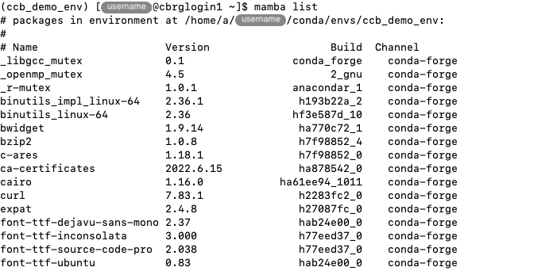
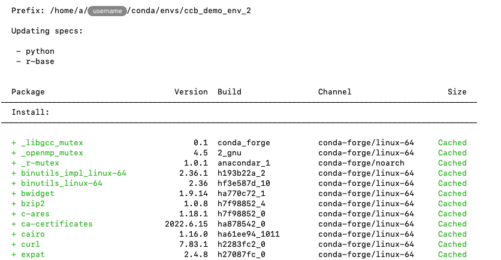
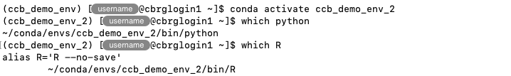
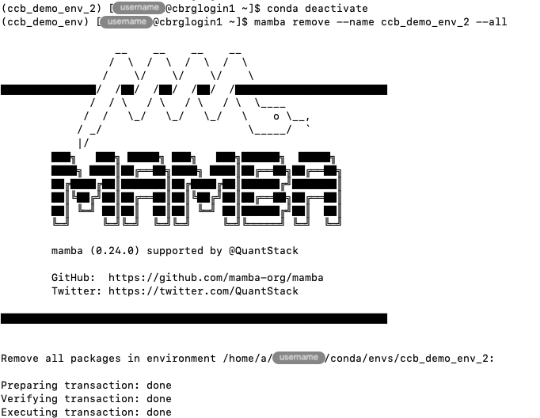
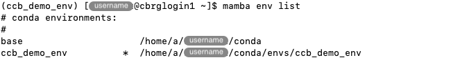

## Motivation

Different projects often require different versions of the same program,
or even mutually incompatible versions of different programs.

Conda provides the possibility to create and manage distinct environments,
each containing a set of software packages that is independent from
all other Conda environments on the same computer.

Upon initial installation
(see section [Install Miniconda]()),
the Conda installer automatically creates an environment called `base`.
We recommend keeping the `base` environment as minimal as possible,
and creating new Conda environments for testing and working as required
by individual projects.
A notable exception is the `mamba` package that we recommend installing
directly in the `base` environment
(see section [First steps with Conda]()).

## Get started

Remember to activate the `base` Conda environment.

For instance, using the alias defined on the page [Install Miniconda]():

```bash
conda_activate_base
```

The `conda env` command includes a set of sub-commands to create and manage
Conda environments.



The `conda env --help` command can be used to display the help page and the
list of available sub-commands.

```bash
mamba env --help
```


## List environments

The `mamba env list` command can be used to list existing Conda environments
(for the current user).

```bash
mamba env list
```




## Create an environment

The `mamba create` command can be used to create a new environment.

```bash
mamba create -n ccb_demo_env
```


In particular:

- The option `-n` declares the name of the environment to create.
  This must be a name that is not used yet (use `mamba env list`
  to list existing environments).

At this point, the command `mamba env list` can be used to verify that
the new environment was created.

```bash
mamba env list
```


In particular:

- Each environment is listed on a separate line, indicating its name
  and the location of its directory in the filesystem.
- The `*` symbol indicates the environment that is currently active.
  Newly created environments are not automatically activated.
  In this example, the `base` environment is still active at this point.

## Activate an environment

Conda environments do not take effect until they are activated.

In effect, a Conda environment is a directory that contains a specific collection
of conda packages.
Activating an environment loads all the packages that are installed in the directory
associated with that environment.
More information on Conda environments is available in the
[Conda documentation][conda-concepts-environments].

The `conda activate <name>` command can be used to activate an environment
using the name of that environment.

For instance, the `ccb_demo_env` environment that we created above can be activated
as follows:

```bash
conda activate ccb_demo_env
```


Separately, the `mamba list` command can be used to verify that the new environment
does not contain any installed package yet.

```bash
mamba list
```


## Install packages in an environment

The `mamba install` command can be used to install packages in the active environment
exactly as in the `base` environment.

For instance, the most recent version of the `python` and `r-base` packages available
can be installed as follows:

```bash
mamba install python r-base
```




Remember to type `Y` and press the Return key when prompted to proceed with the
package installation plan.

The `mamba list` command can be used to verify that the Conda environment now includes
the requested packages, as well as their dependencies.

```bash
mamba list
```





The Bash command `which` can also be used to verify that the `python` and `R`
executable files are now available from within the Conda environment.

```bash
which python
which R
```




## Create an environment from a list of packages

In the previous sections, we have demonstrated two separate steps:

1. creating a new environment
2. installing packages in that new environment

Those two steps can be combined into a single command.

For instance, a new environment named `ccb_demo_env_2` can be created while
immediately installing the latest version of the `python` and `r-base` packages
as follows:

```bash
mamba create -n ccb_demo_env_2 python r-base
```



Again, the `conda activate` command must be used to manually activate the new environment
before it can be used.
Then, the Bash command `which` can be used to verify that the two executable files are
found in the new environment.

```bash
conda activate ccb_demo_env_2
which python
which R
```



## Remove an environment

The `conda remove` command can be used to remove environments that are not needed anymore
(e.g., test environment, completed project).

Importantly, if the environment that you wish to remove is active, make sure to deactivate it
first, using the command `conda deactivate`.

Then, the `mamba remove` command can be used with a number of options.
In particular:

- The option `--name` specifies the name of the environment to remove.
- The option `--all` indicates that all packages in that environment
  must be removed.
  This option is essential to indicate that the entire environment
  must be removed.

```bash
conda deactivate
mamba remove --name ccb_demo_env_2 --all 
```



The `mamba env list` command can be used to verify that the environment removed is indeed
not listed anymore.

```bash
mamba env list
```



## Create an environment from a YAML file

Conda supports the the YAML file format for describing Conda environments, as well
the desired channel priority list and environment name.

For instance:

```yaml
name: ccb_demo_yaml
channels:
- bioconda
- conda-forge
- defaults
dependencies:
- python
- r-base
```

Create a file named `ccb_demo.yaml`, use copy and paste to fill it with the contents above,
and save and close the file (for instance, use `nano`).

```bash
nano ~/ccb_demo.yaml
```

Then, the `mamba install` command can be used to create an environment using that file,
as follows:

```bash
mamba env create -f ~/ccb_demo.yaml
```

It is possible to override the name of the environment specified in the YAML using the
option `-n`, to give a different name to the new environment.

For instance:

```bash
mamba env create -n ccb_demo_from_yaml -f ~/ccb_demo.yaml
```

Again, the `conda activate` command can be used to activate the new environment.

```bash
conda activate ccb_demo_yaml
```

## Export an environment to a YAML file

The `conda env export` command can be used to export the specifications of an environment
to a YAML file that may be saved for the record, or shared and used to replicate that
environment elsewhere.

For instance, the contents in YAML format can be viewed as follows:

```bash
mamba env export -n ccb_demo_env
```

The output of the command above can be redirected to a file using the `>` symbol,
as follows:

```bash
mamba env export -n ccb_demo_env > ~/ccb_demo_env.yaml
```

<!-- Link definitions -->

[conda-concepts-environments]: https://docs.conda.io/projects/conda/en/latest/user-guide/concepts/environments.html
