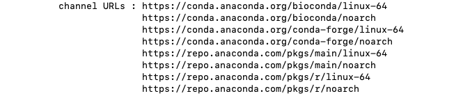

## Pre-requisite

Activate the `base` Conda environment, as demonstrated in the page [Install Miniconda]().

## Help and information

The `conda --help` command can be used to list the main sub-commands of the `conda`
executable, along with a brief description of their purpose.

```bash
conda --help
```


The `conda info` command can be used to display information about your current installation.

```bash
conda info
```




## Configuration

Conda packages are stored in different locations called _channels_.
More information is available in the [Conda documentation][conda-channels].

Configured channels are searched in a specific order when installing packages,
so it is important to configure which channels are searched and in which order.

We recommend the following channels, in decreasing order of priority:

- `bioconda`
- `conda-forge`
- `default`

Adding new channels automatically puts them at the top of the priority list,
so the commands below add channels from the lowest priority channel to the highest
priority one, to produce the desired order of priority described above.

```bash
conda config --add channels defaults
conda config --add channels conda-forge
conda config --add channels bioconda
```

The `conda info` command (described above) can be used to verify the list of channels
that are currently configured, among other pieces of information.



## List packages

The `conda list` command can be used to list the packages installed in the current
environment

```bash
conda list
```




## Update packages

The `conda update` command can be used to updates conda packages (in the current environment)
to the latest compatible version.

The `--all` option checks all packages in the environment (rather than explicitly specifying
individual packages).

```bash
conda update --all
```

<!-- Link definitions -->

[conda-channels]: https://docs.conda.io/projects/conda/en/latest/user-guide/concepts/channels.html