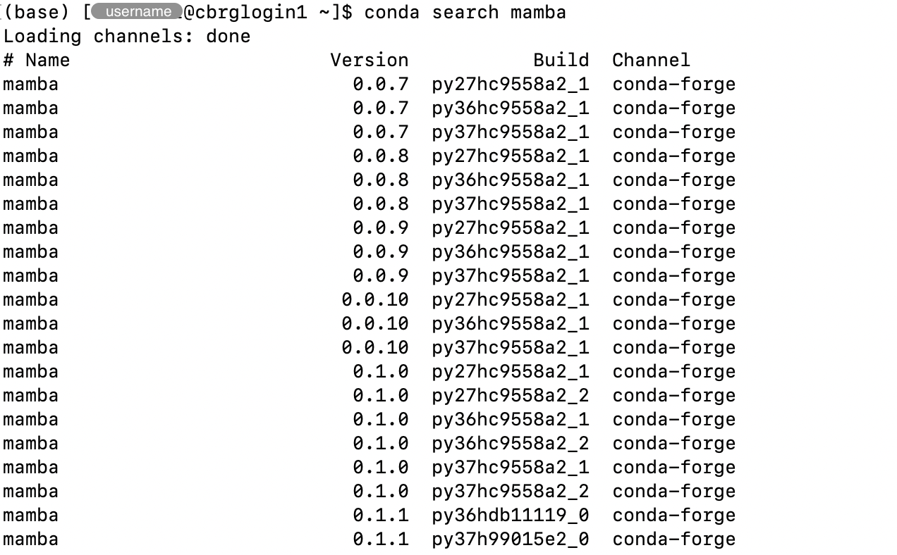
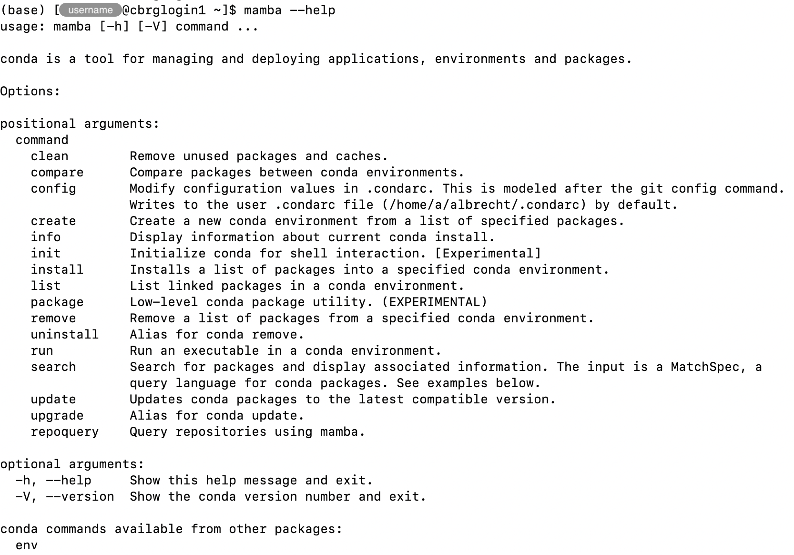

## Pre-requisite

Activate the `base` Conda environment, as demonstrated in the page [Install Miniconda]().

## Help and information

The `conda --help` command can be used to list the main sub-commands of the `conda`
executable, along with a brief description of their purpose.

```bash
conda --help
```


The `conda info` command can be used to display information about your current installation.

```bash
conda info
```




## Configuration

Conda packages are stored in different locations called _channels_.
More information is available in the [Conda documentation →][conda-channels].

Configured channels are searched in a specific order when installing packages,
so it is important to configure which channels are searched and in which order.

We recommend the following channels, in decreasing order of priority:

- `bioconda`
- `conda-forge`
- `default`

In other words, Conda will attempt to install packages from the `bioconda` channel
first, and then sequentially search the channels `conda-forge` and `defaults` when
packages cannot be found in earlier channels in the priority list.

Adding new channels automatically moves them to the top of the priority list.
With that in mind, the commands below sequentially add channels from the lowest
priority channel to the highest priority one, to produce the desired order of
priority described above.

```bash
conda config --add channels defaults
conda config --add channels conda-forge
conda config --add channels bioconda
```

The `conda info` command (described earier on this page) can be used to verify
the list of channels that are currently configured, among other pieces of information.


## List installed packages

The `conda list` command can be used to list the packages installed in the current
environment.

```bash
conda list
```




## Update installed packages

The `conda update` command can be used to updates conda packages (in the current environment)
to the latest compatible version.

The `--all` option checks all packages in the environment (rather than explicitly specifying
individual packages).

```bash
conda update --all
```

In particular, the command will produce a detailed plan, listing packages that may be
downloaded and updated in the Conda environment.

We recommend careful reviewing the information detailed in the package update plan before agreeing to
proceed, by typing `y` and pressing the Return key when prompted.


## Update Conda itself

Part of the output of the `conda update` command may report whether a newer version of the `conda` package
itself is available, alongside instructions to update that package.


Follow those instructions when you are ready to update your Conda installation.

```bash
conda update -n base -c defaults conda
```



## Search available packages

The `conda search` command can be used to search for packages available in any of the configured channels.

For instance, the example below demonstrates how to search for a Conda package called `mamba`.
Note that the list of results was rather long and only the first results are shown in the screenshot.

```bash
conda search mamba
```



The output of the `conda search` command includes key information for identifying the list of versions
available and potentially selecting a specific build to install.
For instance, the `Channel` column indicates the channel in which each package build is stored, which
can be especially important for packages available from different channels.

## Verify that a package is not installed

The `conda list <package>` command can be used with the name of a specific package, to list any version of that
package installed in the environment.

The output will be presented as a table, and the table will be empty (i.e., only column headers)
if the package is not currently installed in the environment.

```bash
conda list mamba
```


Alternatively, the Bash command `which` can be used to check whether an executable known to be present
in a Conda package is detected on the `PATH`.

```bash
which mamba
```


## Install a package

The `conda install` command can be used to install packages.

However, the built-in Conda installer can be quite slow to identify and resolve dependencies
between packages, which led to a re-implementation of the conda package manager in C++,
distributed in the `mamba` package.

Install the `mamba` package using the command below.
Make sure to type `y` and press the Return key when prompted to proceed with the package plan.

```bash
conda install mamba
```


## Verify that a package is installed

In the example below, the `conda list <package>` command is used to list installed packages
that contain the pattern `mamba` in their name.

```bash
conda list mamba
```


In the example below, the Bash command `which` is used to display the location of the executable
`mamba` that is now detected on the `PATH`.

```bash
which mamba
```


Alternatively, the `mamba` executable itself can be invoked, for instance with the `--help` option,
to display the help page of the program, implictly verifying that the executable itself is installed
and working properly.

```bash
mamba --help
```



## Using Mamba

Mamba is implemented as a drop-in replacement for Conda.

In other words, the `mamba` executable can be used in many cases as a replacement
for the `conda` executable, to produce the same result much more rapidly.

For instances:

```bash
mamba info
mamba update --all
mamba search <package>
mamba install <package>
```

Replace `<package>` by the actual name of any package of interest to you.

<!-- Link definitions -->

[conda-channels]: https://docs.conda.io/projects/conda/en/latest/user-guide/concepts/channels.html
