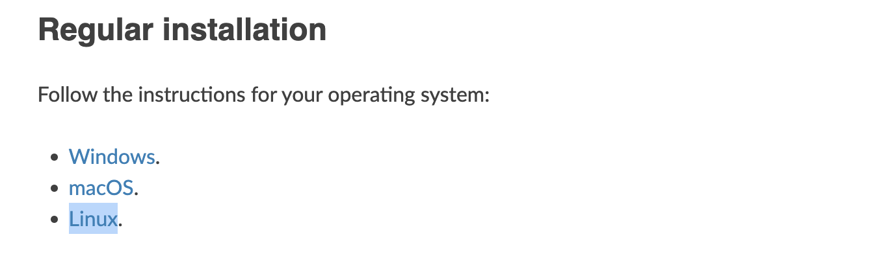
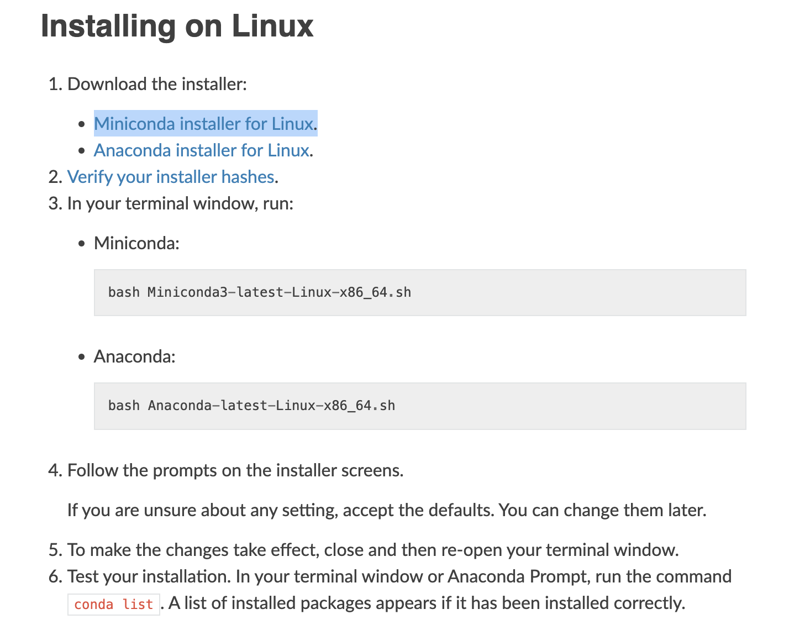
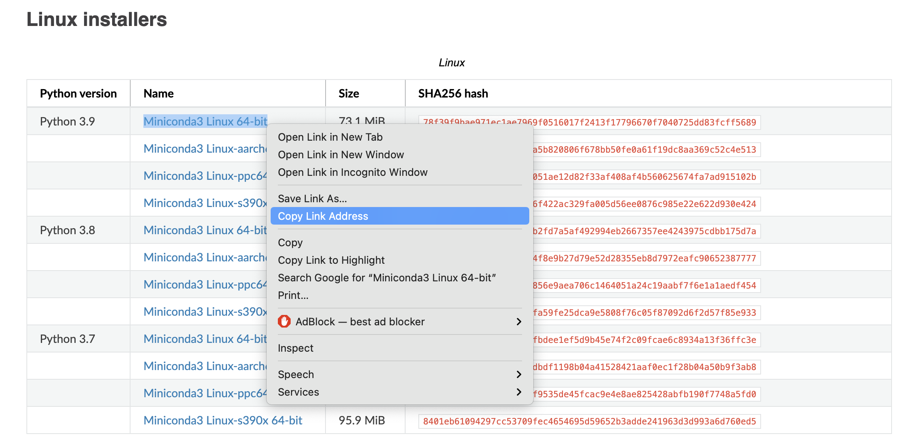
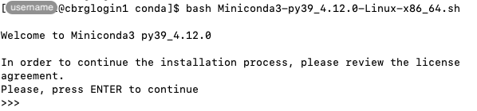
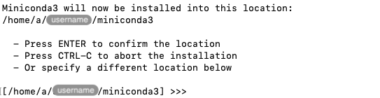
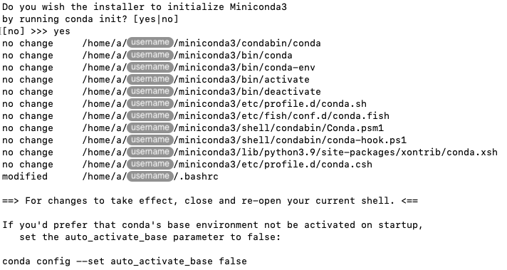
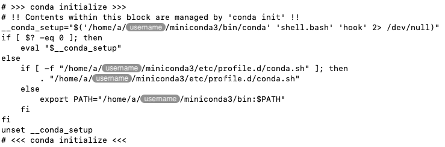
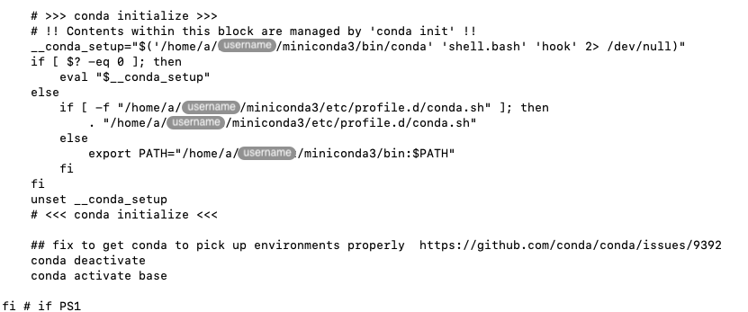

## Source

This page follows is based on the [Installation →][conda-installation] page of the
Conda documentation.

Specifically, scroll down to the [Regular installation →][conda-regular-installation]
section, and follow the link for the [Linux][conda-regular-installation-linux] operating
system.



<p align='center'><i>Link to instructions for a regular installation on Linux.</i></p>

## Download the installer

In the page that you navigated to at the end of the previous section,
follow the link to the [Miniconda installer for Linux][miniconda-installer-for-linux].



<p align='center'><i>Link to the Miniconda installer for Linux.</i></p>

In the table listing various Linux installers, right-click on the link to
`Miniconda3 Linux 64-bit` associated with the most recent version of Python
in the table, and click on `Copy Link Address` (Safari) in the contextual menu,
or equivalent option for your specific web browser.



<p align='center'><i>Link to the Miniconda installer for Linux.</i></p>

Log into the CCB cluster over SSH.

For a tidy installation process, we recommend creating and working in a
temporary directory for the duration of the process.
In you home directory create a directory called `conda`, change working directory
to that directory, and download the Conda installer in that new directory using the
link that you copied to your clipboard above.

```bash
mkdir ~/conda
cd ~/conda
wget <url_in_clipboard>
```

Instead of `<url_in_clipboard>`, paste the link address to the installer that you copied
into your clipboard above.

## Verify the installer hash

While optional, we recommend to verify the integrity of the installer that you have just
downloaded, to ensure that the file was not corrupted during the download process.

In your Terminal application, type the `sha256sum` command followed by the name of the
installer file that you just downloaded.

For instance:

```bash
sha256sum <filename>
```

Replace `<filename>` by the name of the installer file that you just downloaded.


<p align='center'><i>Example output of the `sha256sum` command.</i></p>

Compare the output of the command with the value of the field `SHA256 hash` in the table
of download links, and make sure that it matches the two values are exactly identical.




<p align='center'><i>Compare the output of the `sha256sum` command to the hash of the original file.</i></p>

## Run the installer

```bash
bash <filename>
```

Replace `<filename>` by the name of the installer file that you just downloaded.

When prompted, press `ENTER` (i.e., the Return key) to continue the installation process.



<p align='center'><i>Running the Miniconda installer.</i></p>

Review the End User License Agreement (press the Space bar to scroll down), and
when prompted, type `yes` to accept the license terms.

When prompted, press `ENTER` to confirm your home directory as the location where
Miniconda will be installed.



<p align='center'><i>Setting the installation directory for Miniconda.</i></p>

When prompted, type `yes` to allow the installer to run `conda init`.





<p align='center'><i>Allowing the Miniconda installer to run 'conda init'.</i></p>

## Edit your .bashrc file

At the end of the previous section, we allowed the Miniconda installer to automatically
add some contents to your `~/.bashrc` file.
Those contents ensure that Conda is initialised every time you log into the CCB cluster
over SSH.



<p align='center'><i>Automatically generated contents added to the '~/.bashrc' file.</i></p>

However, those contents are initially added at the very end of the file, outside the
block of code controlled by the statement `if [[ $PS1 ]]; then`
(see section [The .bashrc file]()).
This is an issue on the CCB cluster, as the `~/.bashrc` file is also executed in the
non-interactive Bash sessions launched for each job submitted to the
[Slurm workload management system](),
which may cause issues during the execution of jobs.

To make sure that Conda is only initialised in interactive Bash sessions, you need to move
those contents inside the block of code controlled by the statement `if [[ $PS1 ]]; then`.
For clarity and readability, it is also recommend to indent those contents by four white
spaces after they are moved.

Conceptually:

```bash
if [[ $PS1 ]]; then

    ## <other contents>

    # >>> conda initialize >>>
    # !! Contents within this block are managed by 'conda init' !!
    __conda_setup="$('/home/a/<username>/miniconda3/bin/conda' 'shell.bash' 'hook' 2> /dev/null)"
    if [ $? -eq 0 ]; then
        eval "$__conda_setup"
    else
        if [ -f "/home/a/<username>/miniconda3/etc/profile.d/conda.sh" ]; then
            . "/home/a/<username>/miniconda3/etc/profile.d/conda.sh"
        else
            export PATH="/home/a/<username>/miniconda3/bin:$PATH"
        fi
    fi
    unset __conda_setup
    # <<< conda initialize <<<

fi # if PS1
```

Note that in the example above, `<username>` represents your own username, and 
`## <other contents>` represents other contents in that section of your own `~/.bashrc` file.



Lastly, add the following lines between the closing `<<< conda initialize <<<` line and the final
`fi # if PS1` line.

```bash
    ## fix to get conda to pick up environments properly  https://github.com/conda/conda/issues/9392
    conda deactivate
    conda activate base
```

As the comment indicates, those lines address a known issue, making sure that the base Conda
environment is activated in a way that all Conda environments are detected properly.

The screenshot below exemplifies the expected appearance of the final lines of the `~/.bashrc`
file after applying the edits described in this section.



<p align='center'><i>View of the final lines of the edited '.bashrc' file.</i></p>

<!-- Link definitions -->

[conda-installation]: https://docs.conda.io/projects/conda/en/latest/user-guide/install/index.html
[conda-regular-installation]: https://docs.conda.io/projects/conda/en/latest/user-guide/install/index.html#regular-installation
[conda-regular-installation-linux]: https://docs.conda.io/projects/conda/en/latest/user-guide/install/linux.html#install-linux-silent
[miniconda-installer-for-linux]: https://docs.conda.io/en/latest/miniconda.html#linux-installers
