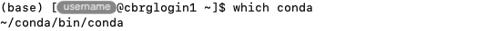

## Download the installer

In a new Terminal application, log into the CCB cluster.

Download the latest Miniconda installer for Linux using the following command.

```bash
wget https://repo.anaconda.com/miniconda/Miniconda3-latest-Linux-x86_64.sh
```

For reference, the URL to the installer file was obtained from the
[Latest Miniconda installer links][miniconda-installers-latest].

## Run the installer

Use `bash` to execute the installer file.

The option `-b` runs the installer in 'batch' mode (without manual intervention).

The option `-p` specifies the installation path, the location where Conda will
be installed.
We recommend specifying `~/conda`, which will create a directory `conda` in your
home directory.

```bash
bash Miniconda3-latest-Linux-x86_64.sh -b -p ~/conda
```



Once the installation successfully completes, you may want to delete the installer
file.

```bash
rm Miniconda3-latest-Linux-x86_64.sh
```

## Test the installation

Before going further, we recommend testing that the new installation of Conda works
as expected.

First, the `source` command executes a script that makes Conda discoverable in the
Bash environment of your Terminal application.

Then, the `conda` command is used to activate the `base` environment that was
created during the installation process.

```bash
source ~/conda/etc/profile.d/conda.sh
conda activate base
```


The `which` command can also be used to verify that the `conda` command
is found on the `PATH`, in the expected location.

```bash
which conda
```



## Deactivate the environment

Before going further, we recommend deactivating the `base` environment.

To do so, the `conda` command is used with the `deactivate` sub-command.

```bash
conda deactivate
```

<!--  -->



## Create a shortcut

Open the `~/.bashrc` file and add the following lines.

```bash
# Create an alias to activate the Conda base environment
alias conda_activate_base='source ~/conda/etc/profile.d/conda.sh && conda activate base'
```

## Test the shortcut

Source the `~/.bashrc` file and test the alias.

```bash
source ~/.bashrc
conda_activate_base
```

Screenshot.

<!-- Link definitions -->

[miniconda-installers-latest]: https://docs.conda.io/en/latest/miniconda.html#latest-miniconda-installer-links
