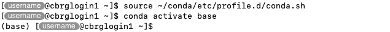

## Download the installer

In a new Terminal application, log into the CCB cluster.

Download the latest Miniconda installer for Linux using the following command.

```bash
wget https://repo.anaconda.com/miniconda/Miniconda3-latest-Linux-x86_64.sh
```

For reference, the URL to the installer file in the command above was obtained
from the [Latest Miniconda installer links][miniconda-installers-latest].

## Run the installer

Use `bash` to execute the installer file as demonstrated below.

```bash
bash Miniconda3-latest-Linux-x86_64.sh -b -p ~/conda
```

Note the use of options to control the behaviour of the installer:

- The option `-b` runs the installer in 'batch' mode (without manual intervention).
  This assumes that you agree to the license agreement.
  It also prevents the installer from modifying your `~/.bashrc` file.
- The option `-p` specifies the installation path, the location where Conda will
  be installed.
  We recommend specifying `~/conda`, which will create a directory `conda` in your
home directory.



Once the installation successfully completes, you may want to delete the installer
file.

```bash
rm Miniconda3-latest-Linux-x86_64.sh
```

## Test the installation

Before going further, we recommend testing that the new installation of Conda works
as expected.

```bash
source ~/conda/etc/profile.d/conda.sh
conda activate base
```



First, the `source` command executes a script that makes Conda discoverable in the
Bash environment of your Terminal application.
This command is not expected to return any information in the Terminal.

Then, the `conda` command is used to activate the `base` environment that was
created during the installation process.
Again, this command is not expected to return any information in the Terminal.
However, after that command completes, the prefix `(base)` should be visible
at the start of the prompt.

The `which` command can also be used to verify that the `conda` command
is found on the `PATH`, at the expected location.

```bash
which conda
```


## Deactivate the environment

Before going further, we recommend deactivating the `base` environment.

To do so, the `conda` command is used with the `deactivate` sub-command.

```bash
conda deactivate
```



## Create a shortcut

Open your `~/.bashrc` file and add the following lines.

```bash
# Create an alias to activate the Conda base environment
alias conda_activate_base='source ~/conda/etc/profile.d/conda.sh && conda activate base'
```

## Test the shortcut

Run the following lines of code sequentially.

```bash
source ~/.bashrc
conda_activate_base
```


First, the `source` command is used to execute the commands in `~/.bashrc` file,
including the `alias` command that defines the new shortcut.

Then, the newly defined alias is used to invoke the command that is now assigned to it.
This shortcut should have the same effect as typing the full command defined in the alias,
activating the `base` Conda environment and adding the `(base)` prefix to the prompt.

## Next steps

From this point, new instances of the Terminal application will automatically execute the
`~/.bashrc` file and define the alias as soon as you connect to the CCB cluster.

As a result, when you connect to the CCB cluster in new instances of the Terminal application,
you will only need to call the alias by name.

```bash
conda_activate_base
```


Furthermore, you should only call the alias once per Terminal application, as there is no
benefit to activate the `base` environment multiple times per session.

The only exception being if you deactivate the `base` environment and wish to re-activate it.
For instance, notice the `(base)` prefix appearing and disappearing from the promp
as the environment is activated and de-activated in the example below:

```bash
conda_activate_base
conda deactivate
conda_activate_base
```


<!-- Link definitions -->

[miniconda-installers-latest]: https://docs.conda.io/en/latest/miniconda.html#latest-miniconda-installer-links
