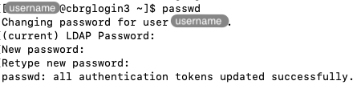

## Motivation

The initial randomly generated password that you received by email is at risk
of being stolen and misused if your email account were ever hacked.
Separately, the randomness of the password makes it very difficult to remember
and type manually.

It is highly recommended to change that initial password on your first
connection to the CCB cluster.

## Instructions

First, log into the CCB cluster as demonstrated on the page
[First SSH connection]().

Next, type the command `passwd` and press the Return key.
Then, follow the instructions returned by the command in the Terminal.
In particular, when prompted, type (or copy-paste) your current password
(the randomly generated password that you were given in the email),
and then type your new desired password twice, pressing the Return key
each time.

You should then see a message indicating that your password was updated
successfully.

```bash
passwd
```





<!-- Link definitions -->
