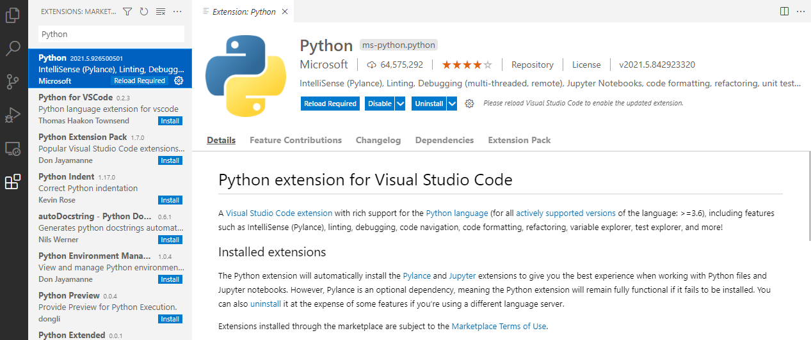
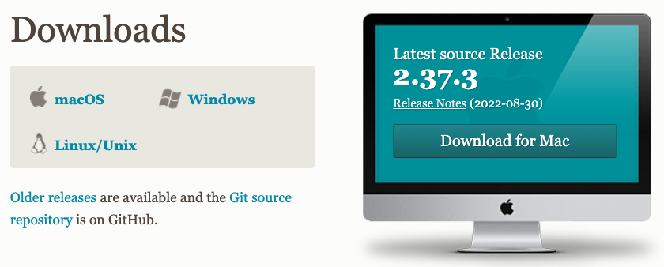

## Install VSCode

- Download from website.
- Run installer.
- Go to 'Extension' tab on the left.
  - Install 'Python'. (screenshot)
  - Install 'Live Share Extension Pack'. (screenshot)

## Install Git Bash for Windows

### Motivation

Microsoft Windows does not have a built-in Terminal emulator
(The MS Windows Command Prompt `cmd.exe` is a command-line interpreter
that does not include many of the commands needed to connect to
the CCB cluster).

The primary function of the Git Bash for Windows program is to provide
a Bash emulation used to run Git from the command line.
Conveniently, in its effort to offer that functionality,
the Terminal emulator of Git Bash for Windows also includes
all the commands that you will need to connect to the CCB cluster.

### Download the installer file

In your web browser, navigate to <https://git-scm.com/downloads>.

In the 'Downloads' section, click on 'Windows'.

On the next page, click on the first link
'Click here to download the latest 32-bit version of Git for Windows'.

### Run the installer

Double-click on the installer file that you just downloaded
and progress through the screens of the installation program.



Notably:

- Scroll to the bottom of the license.
  Click 'Next'.
- Leave the destination location for the installation to the default value.
  Click 'Next'.
- Select 'Add a Git Bash Profile to Windows Terminal' in addition to the components selected by default.
  Click 'Next'.
- Leave the name of the Start Menu folder to be created to the default value.
  Click 'Next'.
- Set the default editor for Git to a text editor program that is installed on your computer
  and that you are comfortable with.
  We recommend [Visual Studio Code][visual-studio-code].
  Click 'Next'.
- Leave the default choice letting Git decide the name for the initial branch
  in newly created repositories.
  Click 'Next'.
- Leave the default choice adjusting your PATH environment.
  You want to be able to use Git from Git Bash, the Command Prompt and the Windows PowerShell
  as well as third-party software looking for Git in PATH (e.g., RStudio Desktop).
  Click 'Next'.
- Leave the default choice using the bundled OpenSSH.
  Click 'Next'.
- Leave the default choice using the OpenSSL library.
  Click 'Next'.
- Select 'Checkout as-is, commit Unix-style line endings'.
  Click 'Next'.
- Leave the default choice using MinTTY.
  Click 'Next'.
- Leave the default behaviour of `git pull` to the default value.
  Click 'Next'.
- Leave the credential manager to the default value.
  Click 'Next'.
- Leave the extra options to their default choices.
  Click 'Next'.
- Leave the experimental options unselected.
  Click 'Install'.

When the installer successfully completes, click 'Finish'.

You may be presented with the Release Notes of the program, which you may choose to read
before you close them.

### Test your installation

Once the installer has completed successfully:

- Open the Windows Start Menu.
- In the Windows Start Menu find and launch 'Git Bash'.
- In the Git Bash for Windows Terminal emulator, type `git` and press the `Return` key.

This should display a help message listing the main subcommands of the Git program.

## Install Anaconda navigator

Download the installer file from the [Anaconda website][anaconda-download].

### Run the installer

- Run installer.
- Install for all users.
- Accept all defaults.

### Test your installation

- Open the Windows Start Menu.
- In the Windows Start Menu find and launch 'Anaconda Navigator (Anaconda3)'.

If prompted about a new version of Anaconda Navigator available,
click 'Yes' to update.

<!-- Link definitions -->

[atom-editor]: https://atom.io/
[notepad-plus-plus]: https://notepad-plus-plus.org/
[visual-studio-code]: https://code.visualstudio.com/
[anaconda-download]:https://www.anaconda.com/
