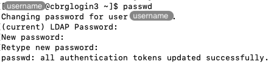

## Motivation

The initial randomly generated password that you received by email is at risk
of being stolen and misused if your email account were ever hacked.
Separately, the randomness of the password makes it very difficult to remember
and type from memory.

It is highly recommended to change that initial password on your first
connection to the CCB cluster.
To do so, in a Terminal logged in the CCB cluster, type the command `passwd`
and press the Return key, as follows:

```bash
passwd
```



<p align='center'><i>Changing your password.</i></p>

When prompted, first type your current password (the randomly generated
password that you were given in the email), and then type your new desired
password twice, pressing the Return key after each password.



You should then see a message indicating that your password was updated
successfully.

<!-- Link definitions -->
