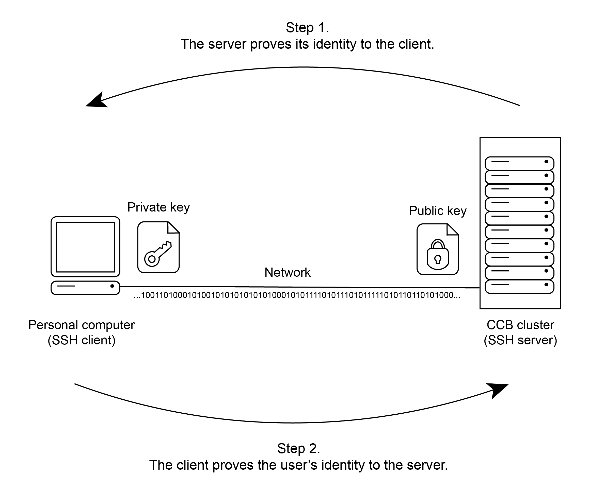
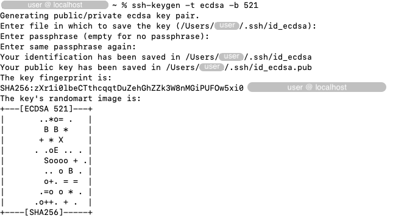
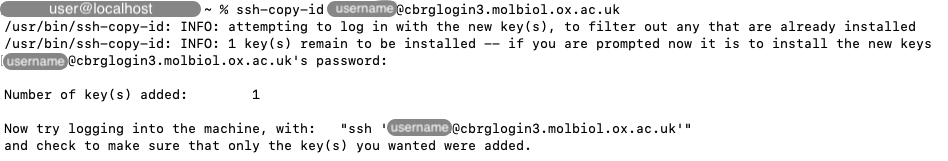
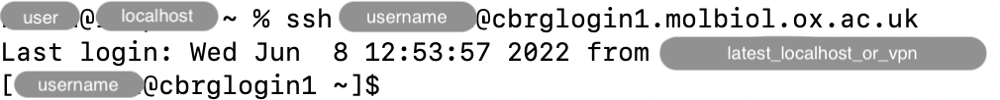

## Motivation

An SSH key pair can be used as an additional layer of security to connect to
your account on the CCB HPC cluster.
Instead of typing your username and password, it is possible to log into your
account on the CCB cluster using a pair of files;
one file on your personal computer (the "private" key),
one file on the CCB cluster (the "public" key).
Together, those two files enable your personal computer and the cluster to identify
themselves to each other.



## Creating an SSH key pair

To create the SSH key pair, open a Terminal session on your personal computer
(i.e., not logged into the CCB cluster), and type:

```bash
ssh-keygen -t rsa -b 4096
```

In particular:

- The option `-t rsa` is important to generate the right type of SSH key pair.
- The option `-b 4096` indicates the number of bits in the key; a minimum of 2048
is recommended, while larger values generally give additional strength to the
key.

When prompted for a filename, do not type anything, and immediately press the
`Return` key to accept the default filename and location.

When prompted for a passphrase, we recommended typing a password that is
secret yet memorable to you. This passphrase will be the last line of defense
if anyone were to maliciously acquire your private SSH key file.
Alternatively, you can press the `Return` key immediately without entering a
passphrase, leaving your SSH key pair unprotected.



When prompted to confirm your passphrase, type the same passphrase and press
the `Return` key.

Finally, the Terminal should display a message indicating that the key pair was
successfully created.



In particular:

- The private key is located at `~/.ssh/id_rsa`.
- The public key is located at `~/.ssh/id_rsa.pub`.



## Adding the public key on the CCB cluster

Finally, the public key
-- generated and saved as a file on your own computer --
needs to be copied to your account on the CCB cluster,
so that the CCB cluster can prove its identity to the client
(see above, [Motivation](#motivation)).

Conceptually, the command that you type in the Terminal on your personal computer
should be structured as follows:

```bash
ssh-copy-id <username>@<remote>
```

Replace `<username>` by your own username, and `<remote>` by one of the
login nodes (see [General information]()).

If the public key indeed does not exist on your CCB cluster account yet,
you will be prompted for your password.
Type it, and press the `Return` key.

This adds the public key to the file `~/.ssh/authorized_keys` on your
account on the CCB cluster.



## Configuring the SSH client

Having set up the SSH key pair on your own computer and the CCB cluster,
you still need to configure the SSH client so that it uses the private key
whenever you invoke the `ssh` command, to prove your identity to the CCB cluster,
and _vice versa_.

Open (or create) the file `~/.ssh/config` _on your personal computer_.
You may do so using any text editor of your choice, including
graphical applications (e.g., [Sublime Text][sublime-text])
or Terminal text editors such as those listed in the section
[Editing files in the Terminal]().

In that file, add the following lines:

```bash
Host *
    IdentityFile ~/.ssh/id_rsa
    Port 22
    Protocol 2
    TCPKeepAlive yes
    ServerAliveInterval 300
    ServerAliveCountMax 2
    ForwardX11 yes
    ForwardX11Trusted yes
    ForwardAgent yes
    Compression yes
    XAuthLocation /opt/X11/bin/xauth
    # macOS only
    AddKeysToAgent yes
    UseKeychain yes
```



Those lines configure parameters applied to any remote host that you log into
using the `ssh` command.

- The keyword `Host` creates a new set of parameters.
- The pattern `*` matches all hostnames, making those parameters global defaults
  unless overwritten in subsequent declarations.
- The field `IdentityFile` specifies the path to the private SSH key file that
  you created earlier on your personal computer.
- The field `Port` specifies the port number to connect on the remote host.
- The field `Protocol` specifies the protocol version of SSH to use.
- The field `TCPKeepAlive` specifies whether TCP keepaline messages are regularly
  sent, which is useful to notice it the connection dies at any point.
- The field `ServerAliveInterval` sets a timeout interval in seconds after which
  the client will request a response from the server if no data has been received
  recently.
- The field `ServerAliveCountMax` sets the number of server alive messages which
  may be sent to the server without receiving any reply before `ssh` disconnects
  from the server.
- The field `ForwardX11` specifies whether X11 connections will be automatically
  redirected over the secure channel of the `ssh` connection.
- The field `ForwardX11Trusted` specifies whether remote X11 clients are given
  full access to the original X11 display
- The field `ForwardAgent` specifies whether the connection to the authentication
  agent (if any) is forwarded to the remote machine.
- The field `Compression` specifies whether to use compression.
- The field `XAuthLocation` specifies the full pathname of the `xauth` program.

More information about fields that may be configured is available on the page
[ssh_config(5) - Linux man page →][ssh-config-linux].

MacOS-only fields:

- The field `AddKeysToAgent` specifies whether keys should be automatically added
  to a running `ssh-agent`.
- The field `UseKeychain` specifies whether passphrases are stored in the keychain.

More information about fields that may be configured for macOS is available on the page
[OpenBSD manual page server →][ssh-config-openbds].

More information on the field `UseKeychain` is available on the page
[Technical Note TN2449 →][usekeychain-technical-note].

## Log in using your SSH key pair

You can now log into the CCB cluster using the same `ssh` command as before,
without the need to type in your account password.
However, if you have set a passphrase on your SSH key pair, you will be
prompted to type this passphrase when the SSH key pair is used.

```bash
ssh <username>@<remote>
```

The screenshot below demonstrates the `ssh` command in action.





<!-- Link definitions -->

[ssh-config-linux]: https://linux.die.net/man/5/ssh_config
[ssh-config-openbds]: https://man.openbsd.org/ssh_config
[usekeychain-technical-note]: https://developer.apple.com/library/archive/technotes/tn2449/_index.html
[sublime-text]: https://www.sublimetext.com/
