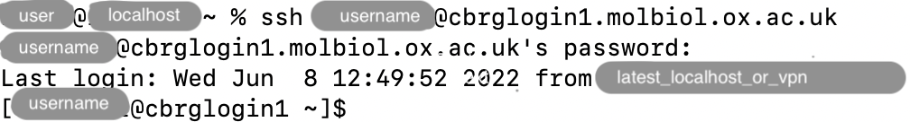

## What is SSH?

SSH stands for Secure Shell.

This refers to an encrypted network protocol for establishing a secure connection
to a remote server.
The connection is materialised as a remote command line login to a Linux system.

The protocol uses a username and password to authenticate a user on the remote system.

It can be used to log into the CCB cluster.

## Choose a login node

The CCB cluster has three login nodes that users can log into using SSH:

- `cbrglogin1.molbiol.ox.ac.uk`
- `cbrglogin2.molbiol.ox.ac.uk`
- `cbrglogin3.molbiol.ox.ac.uk`

Here is some guidance to choose a login node:

- Login nodes with more active users are less responsive.
  If you notice a drop in performance for simple commands (e.g., `ls`),
  consider logging out and connecting to a different login node.
- The login node `cbrglogin3.molbiol.ox.ac.uk` has more memory available (1TB),
  relative to only 250G on the other login nodes.
  If you are testing commands that require larger amounts of memory,
  consider connecting to that node.

## Log in with your username and password

When your account is created on the CCB cluster, you will be sent an email
including your unique username on the CCB cluster and a randomly generated
password.

To log into a login node, open a Terminal on your personal computer and use
the `ssh` command, combining your username, the `@` symbol, and the name of
the login node that you wish to log into.
Conceptually, the command that you type in the Terminal should be structured
as follows:

```bash
ssh <username>@<remote>
```

Replace `<username>` by your own username, and `<remote>` by one of the
login nodes (see [Login nodes]() section above).
When you have typed the command above, press the Return key to execute it.



If this is indeed your very first connection, you may be prompted to verify
the authenticity of the host.
If this happens, type `yes` and press the Return key to continue connecting.

When prompted for your password, type it and press the Return key.



You should now be logged in the MRC WIMM CCB high-performance computing (HPC)
cluster.

Welcome!

## Log out

To log out of the CCB cluster, you can use any of the following methods:

- Type `exit` and press the Return key.
- Type `logout` and press the Return key.
- Press the Control and D keys simultaneously.

<!-- Link definitions -->
