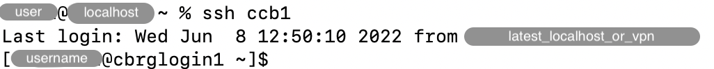

## Motivation

When regularly connecting to one or more remote hosts, it can be tedious to type
or even remember all the parameters in the `ssh` command.
Moreover some parameters remain the same for all remote hosts, while others are
specific to each host.

In this section, we describe how to configure parameters that are specific
to different hosts.

Recommended parameters shared across all remote hosts are described in the earlier
page [Set up an SSH key pair]().

## Configure a remote host

On your personal computer, open the file `~/.ssh/config`,
replace `<username>` by your own username and add the following lines:

```bash
Host ccb1
    Hostname cbrglogin1.molbiol.ox.ac.uk
    User <username>

Host ccb2
    Hostname cbrglogin2.molbiol.ox.ac.uk
    User <username>

Host ccb3
    Hostname cbrglogin3.molbiol.ox.ac.uk
    User <username>
```

Then, save and close the file.

Those lines configure three remote hosts.

* The keyword `Host` creates a new host.
* The field `Hostname` configures the real hostname to log into.
* The field `User` specifies the username to log in as.
* The indentation of fields is optional.
  However, four spaces are commonly used for readability.

More information about fields that may be configured is available on the page
[ssh_config(5) - Linux man page →][ssh-config].

## Connect to a configured remote host

You can now log into the CCB cluster using any of the following commands,
to connect to the corresponding remote host:

```bash
ssh ccb1
ssh ccb2
ssh ccb3
```

Notice how you do not need to specify your username, the hostname,
nor any of the parameters configured for all remote hosts.

In the screenshot below, notice the prompt changing.
Initially, the `ssh` command is typed in the prompt of the personal computer.
Once the connection is established, the prompt of the remote host appears
(in this case, `cbrglogin1`).



<!-- Link definitions -->

[ssh-config]: https://linux.die.net/man/5/ssh_config
