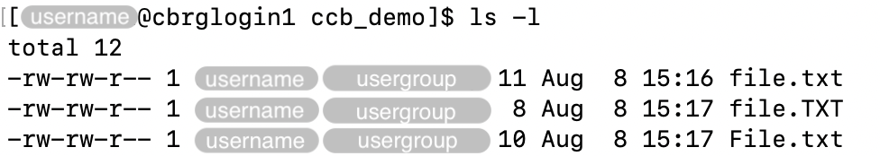

## Case-sensitivity

In Linux, file names are case-sensitive.

In the example below, a series of distinct files stored in the same directory
differ only by the case-sensitivity of their filenames.



Exclusively using lowercase characters generally makes thigs easier and less confusing
to remember.

## Unicity within directories

File names must be unique within each directory.

Bearing in mind the case-sensitivity of filenames described above,
all filenames within a given directory must be distinct.

For instance, using the `>` (greater than) symbol to redirect a stream
to a filename that already exists will overwrite that file
(i.e., it will not create another
file with the same name).

For instance, the code below will either:

- Create the file `file.txt` if it does not exist (and add `Hello` as its contents).
- Overwrite the contents of the file if it already exists.

```bash
echo "Hello" > file.txt
```

## Symbols allowed in filenames

Filenames can included a limited set of characters, including:

- Uppercase and lowercase letters.
- Digits.
- `-` (dash), `_` (underscore).

## Symbols to avoid in filenames

Some characters are not allowed or strongly discouraged in filenames,
due to their special meaning in Linux.

Do not use the ` ` (space) symbol in filenames.
Instead, use the `_` (underscore) or `-` (dash) symbols.

For instance, do not use `my file.txt`; use `my_file.txt` instead.



Avoid using the following special symbols as well:

- `%` (percentage)
- `$` (dollar sign)
- `£` (pound)
- `"` (double quotation mark)
- `'` (single quotation mark)
- `/` (forward slash)
- `\` (back slash)
- `|` (pipe)
- `=` (equal sign)

## Readability

Use distinctive, human-readable names that give an indication of the content.

Follow a consistent pattern that is both user and machine-friendly to parse
and process (e.g. `sample1-replicate1-read1.fastq.gz`).

Organise files into directory structures that follow a consistent pattern,
and make use of suffixes to identify file formats
(e.g., `txt`, `csv`, `sh`).

For instance:

```txt
.
├── data
│   ├── fastq
│   │   ├── sample1.fastq.gz
│   │   └── sample2.fastq.gz
│   └── annotations
│       ├── genome.gtf.gz
│       └── sample_metadata.csv
├── code
│   ├── scripts
│   │   ├── hisat2.sh
│   │   └── featurecounts.sh
│   └── notebooks
│       ├── differential_expression.R
│       └── pathway_analysis.R
├── results
│   ├── sample1.bam
│   ├── sample2.bam
│   └── read_counts.tsv
└── README.txt
```

<!-- Link definitions -->

[10.1371/journal.pcbi.1000424]: https://journals.plos.org/ploscompbiol/article?id=10.1371/journal.pcbi.1000424