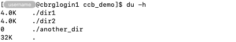
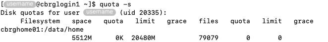

## What is disk space quota?

Briefly, disk space quota are limits on the amount of disk space that individual
users can use on a shared computing system.

Once a user exceeds their allowed disk space quota -- possibly after a set grace
period -- they will not be able to create or edit any file in the filesystem
until they either:

- Delete or compress files, to return within their allowed quota (where
  possible).
- Request an increase to their quota.

## Why monitor disk usage?

CCB accounts are subject to charging as a result of the costs associated with
the necessary storage and computing facilities.

To ensure fair usage of the shared disk resources, the CCB cluster enforces
quotas that restrict the amount of disk space that users may utilise to store
files for their various projects.

Users who exceed their quota may see some of their commands fail on the CCB
cluster, in particular commands that attempt to create files.

Monitoring disk space usage regularly allows users to anticipate times when they
may approach or exceed their allowed quota, and take preventive action,
including:

- Delete unused or intermediate output files.
- Compress large files.
- Request an increase to their quota.

Users are encouraged to regularly check their disk usage and quota, to manage
their files and remain within their disk usage quota or request an increase to
their quota (at an additional cost). Refer to the
[Help]() section for ways to contact system
administrators and request increase to your quotas.

## How to monitor disk usage?

The `du` command can be used to estimate file space usage.

The option `-h` is commonly used to display values in human-readable form (i.e.,
with units).

By default, the `du` command reports the size of each directory in the working
directory.

For instance:

```bash
du -h
```



The option `-s` is commonly used to summarise the total disk space usage across
all the contents of the directory.

Moreover, the `du` command can be given the path to a target directory, instead
of the working directory.

For instance:

```bash
du -hs ~/ccb_demo
```


## How to monitor your quota usage?

The `quota` command can be used to query your current quota usage and total
allowance, across all directories, files, and projects.

The option `-s` displays values in human-readable format (i.e, with units).

```bash
quota -s
```



<!-- Link definitions -->
