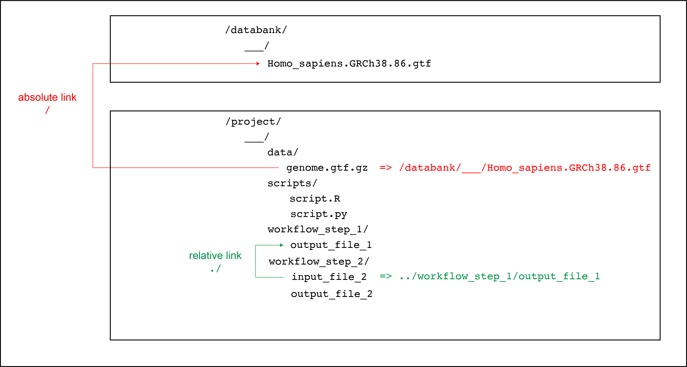

## What are symbolic links?

We describe symbolic links in the section [Link to files and
directories]().

Briefly, a symbolic link is a shortcuts to target file or directory.

The link itself is materialised as a very small file that only indicates the
location of the target file.

As such:

- The size of the target file does not impact in any way the size of the
  symbolic link.
- A symbolic link will always be smaller than the target data file, or a copy of
  that file (unless the target file is empty).

## Why use symbolic links?

A symbolic links make the target file accessible from a different location
(i.e., directory) without the need to make a copy of the file, greatly reducing
disk usage.

## How do I create symbolic links?

We describe the creation of symbolic links in the section [Creating soft
links]().

Briefly:

```bash
ln -s target_file.txt link_file.txt
```

## How to use symbolic links

Symbolic links can be used in place of the original target file.

Often, symbolic links stored in the working directory offer a shorter
alternative to longer file paths to target files located elsewhere in the
filesystem.

For instance:

```bash
ln -s /path/to/target/file.txt link.txt
cat /path/to/target/file.txt
cat link.txt
```

In particular:

- The `ln -s` command is used to create a symbolic link.
- The two `cat` commands are entirely equivalent; the first command directly
  accesses the original file, while the second command follows the symbolic link
  ultimately accessing the same target file.

## Best practices

Relative links should be used to create links _within_ the project directory. In
that way, links will remain valid even in the event that the project directory
is moved.

Absolute links should be used only to link to files outside the project
directory. Most commonly, absolute links are used to link to shared resources in
stable locations (e.g., genome sequence, gene annotations).



<!-- Link definitions -->
