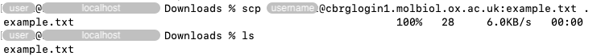
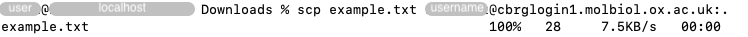
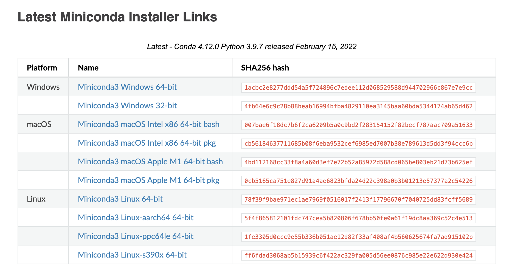
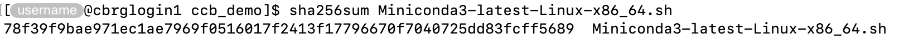
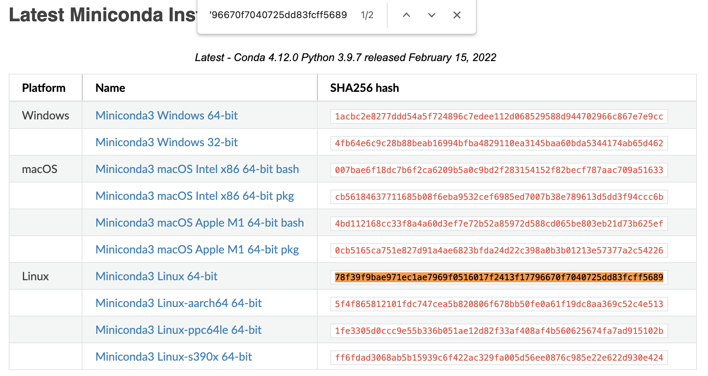
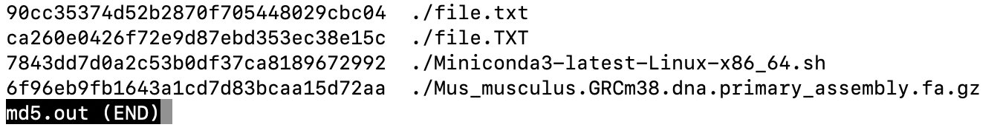
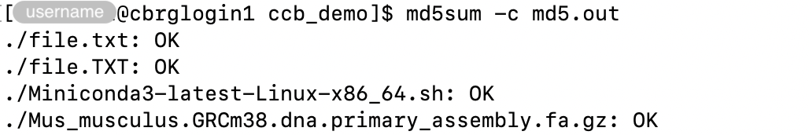

## Commands

### wget

The `wget` command is a free software package for retrieving files using HTTP,
HTTPS, FTP and FTPS; the most widely used Internet protocols.

For instance:

```bash
wget ftp://ftp.ensembl.org/pub/release-102/fasta/mus_musculus/dna/Mus_musculus.GRCm38.dna.primary_assembly.fa.gz
```

By default, the `wget` command downloads files in the working directory. We
recommend using the `cd` command to set the working directory before using the
`wget` command.

Alternatively, the `-P` option can be used to set a directory prefix where all
files and subdirectories will be saved.

For instance:

```bash
wget \
  -P ~/ccb_demo \
  ftp://ftp.ensembl.org/pub/release-102/fasta/mus_musculus/dna/Mus_musculus.GRCm38.dna.primary_assembly.fa.gz
```

### rsync

We describe the `rsync` command in the section [How do I perform a
backup?]().

While the `rsync` command is more commonly used to perform and retrieve backups,
its synchronisation functionality can also be used to download files and
directories.

### curl

The `curl` command can be used to download individual files.

For instance:

```bash
curl \
  -o ~/ccb_demo/Mus_musculus.GRCm38.dna.primary_assembly.fa.gz \
  ftp://ftp.ensembl.org/pub/release-102/fasta/mus_musculus/dna/Mus_musculus.GRCm38.dna.primary_assembly.fa.gz
```

In particular:

- The option `-o` can be used to declare the location and filename of the
  downloaded file.

Alternatively, the options `-O -J` can be used together, to automatically
identify the filename of the original file on the remote computer, and save the
file locally with the same name. However, in that case, the file can only be
downloaded in the working directory. We recommend using the `cd` command to set
the working directory before using those options.

For instance:

```bash
cd ~/ccb_demo
curl \
  -O -J \
  ftp://ftp.ensembl.org/pub/release-102/fasta/mus_musculus/dna/Mus_musculus.GRCm38.dna.primary_assembly.fa.gz
```

In particular:

- `-O` save the file locally using the basename of the original file ()
- `-J` ensures that `-O` respects the basename of the original file on the
  remote computer, instead of extracting a basename from the URL (useful when
  the two are different).

### scp

The `scp` command can be used to copy files and directories to, from, and
between remote machines over SSH.

The first argument to the `scp` command is the source location of the file to
copy, while the second argument specifies the destimation

A file can be securely copied from a remote machine to the local machine using
the following syntax:

```bash
scp <username>@<remote>:<source> <destination>
```

In particular:

- Replace `<username>` by your own username, and `<remote>` by one of the CCB
  login nodes.
- Replace `<source>` by the path to the file that you wish to copy.
- Replace `<destination>` by the path where the file should be copied.
- Relative paths are relative to `<username>`'s hom directory.
- Absolute paths can be used to target any other location that is accessible to
  `<username>`.

For instance, a file can be securely copied _from_ the CCB cluster to the local
machine as follows:



Conversely, a file can be securely copied _to_ the CCB cluster from the local
machine as follows (i.e., swapping the source and the destination):



## Verify integrity of downloads

### Principle

On occasions, files can be corrupted during their transfer.

Several commands -- including `md5sum`, `sha256sum`, and `sum` -- can be used to
rapidly verify whether downloaded files match their original copy on the remote
computer.

For those commands to be of any use, the remote provider of the downloaded files
must have run the command themselves on their side, and made available the
output of the command for each file of interest (as well as instructions to
properly use those outputs).

If that is the case, users can then run the same command on their own copy of
the downloaded files, and compare the output with that of the provider.

### Manual comparison

In some cases, providers display the output of the command on their website.

For instance:



In those case, users should run the command on the downloaded file, and manually
compare the output of the command to the value displayed on the website for the
corresponding file.

For instance:

```bash
sha256sum Miniconda3-latest-Linux-x86_64.sh
```



At that point, rather than visually comparing each character between the two
outputs, we recommend copying the output of the command in the Terminal and
searching for that string of characters on the web page. If the two strings
match, most web browser will highlight the corresponding value on the web page.



### Check MD5 sums in a file

In some cases, providers make the output of the `md5sum` command available as a
file that can be downloaded itself.

The contents of that file typically looks as shown below:



In particular:

- The first column displays the MD5 sum for a specific file.
- The second column display the path to that file (relative to the working
  directory where the `md5sum` command was run from).

Users in possession of that file can give it to the options `-c` of the `md5sum`
command. The `md5sum` command will then run for each file listed in the file,
and automatically compare the value obtained for the downloaded file to the
reference value listed in the file (corresponding to the `md5sum` command run on
the original file on the remote computer).

For instance:

```bash
md5sum -c md5.out
```


