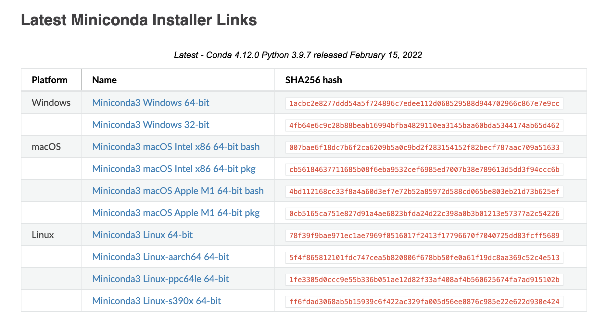
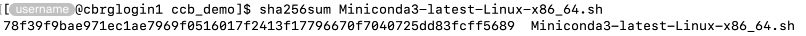
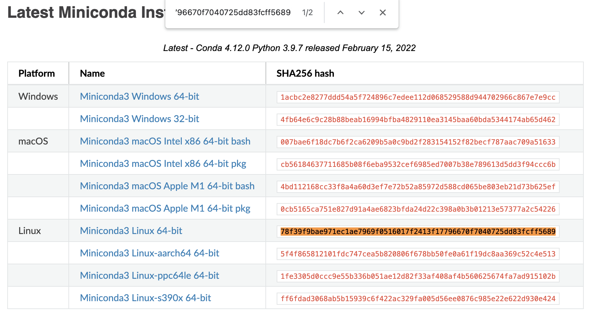
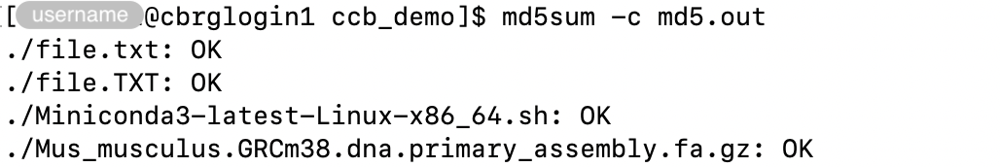

## Public data repositories

Public data repositories provide platforms for distributing commonly used reference
data sets (e.g., reference genomes, gene annotations), as well as experimental data sets
associated with published work.

For instance:

- [FTP Download - Ensembl →][ensembl-ftp]
- [ArrayExpress - EMBL-EBI →][arrayexpress]
- [ENA Browser - European Nucleotide Archive - EMBL-EBI →][ena-browser]
- [Gene Expression Omnibus - NCBI →][geo]
- [Home - SRA - NCBI →][sra]

It is often necessary to download data files from those public repositories onto
the CCB cluster before they can be used by programs running on the CCB cluster.

A number of Linux commands are available to download remote files.

## wget

The `wget` command is a free software package for retrieving files using
HTTP, HTTPS, FTP and FTPS; the most widely used Internet protocols.

For instance:

```bash
wget ftp://ftp.ensembl.org/pub/release-102/fasta/mus_musculus/dna/Mus_musculus.GRCm38.dna.primary_assembly.fa.gz
```

By default, the `wget` command downloads files in the working directory.
We recommend using the `cd` command to set the working directory before using the `wget` command.

Alternatively, the `-P` option can be used to set a directory prefix where all files and subdirectories will be
saved.

For instance:

```bash
wget \
  -P ~/ccb_demo \
  ftp://ftp.ensembl.org/pub/release-102/fasta/mus_musculus/dna/Mus_musculus.GRCm38.dna.primary_assembly.fa.gz
```

## rsync

We describe the `rsync` command in the section
[How do I perform a backup?]().

While the `rsync` command is more commonly used to perform and retrieve backups,
its synchronisation functionality can also be used to download files and directories.

## curl

The `curl` command can be used to download individual files.

For instance:

```bash
curl \
  -o ~/ccb_demo/Mus_musculus.GRCm38.dna.primary_assembly.fa.gz \
  ftp://ftp.ensembl.org/pub/release-102/fasta/mus_musculus/dna/Mus_musculus.GRCm38.dna.primary_assembly.fa.gz
```

In particular:

- The option `-o` can be used to declare the location and filename of the downloaded file.

Alternatively, the options `-O -J` can be used together, to automatically identify
the filename of the original file on the remote computer, and save the file locally
with the same name.
However, in that case, the file can only be downloaded in the working directory.
We recommend using the `cd` command to set the working directory before using those options.

For instance:

```bash
cd ~/ccb_demo
curl \
  -O -J \
  ftp://ftp.ensembl.org/pub/release-102/fasta/mus_musculus/dna/Mus_musculus.GRCm38.dna.primary_assembly.fa.gz
```

In particular:

- `-O` save the file locally using the basename of the original file ()
- `-J` ensures that `-O` respects the basename of the original file on the remote computer,
  instead of extracting a basename from the URL (useful when the two are different).

## Verify integrity of downloads

### Principle

On occasions, files can be corrupted during their transfer.

Several commands -- including `md5sum` and `sha256sum` -- can be used to rapidly
verify whether downloaded files match their original copy on the remote computer.

For those commands to be of any use, the remote provider of the downloaded files
must have run the command themselves on their side, and made available the output
of the command for each file of interest (as well as instructions to properly
use those outputs).

If that is the case, users can then run the same command on their own copy
of the downloaded files, and compare the output with that of the provider.

### Manual comparison

In some cases, providers display the output of the command on their website.

For instance:



In those case, users should run the command on the downloaded file,
and manually compare the output of the command to the value displayed on the website
for the corresponding file.

For instance:



At that point, rather than visually comparing each character between the two outputs,
we recommend copying the output of the command in the Terminal and searching for that
string of characters on the web page.
If the two strings match, most web browser will highlight the corresponding value
on the web page.



### Check MD5 sums in a file

In some cases, providers make the output of the `md5sum` command available as a file
that can be downloaded itself.

The contents of that file typically looks as shown below:

```txt
90cc35374d52b2870f705448029cbc04  ./file.txt
ca260e0426f72e9d87ebd353ec38e15c  ./file.TXT
7843dd7d0a2c53b0df37ca8189672992  ./Miniconda3-latest-Linux-x86_64.sh
6f96eb9fb1643a1cd7d83bcaa15d72aa  ./Mus_musculus.GRCm38.dna.primary_assembly.fa.gz
```

In particular:

- The first column displays the MD5 sum for a specific file.
- The second column display the path to that file
  (relative to the working directory where the `md5sum` command was run from).

Users in possession of that file can give it to the options `-c` of the `md5sum` command.
The `md5sum` command will then run for each file listed in the file, and automatically
compare the value obtained for the downloaded file to the reference value listed in the
file (corresponding to the `md5sum` command run on the original file on the remote computer).

For instance, with a file of MD5 sums called `md5.out`:



<!-- Link definitions -->

[ensembl-ftp]: http://www.ensembl.org/info/data/ftp/index.html/
[arrayexpress]: https://www.ebi.ac.uk/arrayexpress/
[ena-browser]: https://www.ebi.ac.uk/ena/browser
[geo]: https://www.ncbi.nlm.nih.gov/geo/
[sra]: https://www.ncbi.nlm.nih.gov/sra
