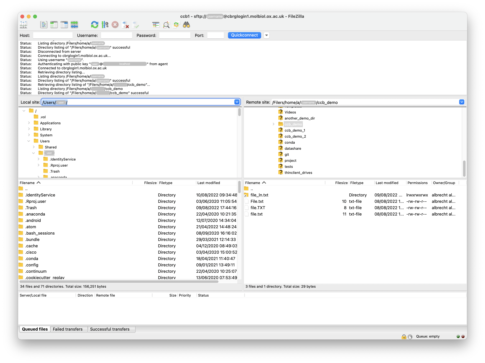
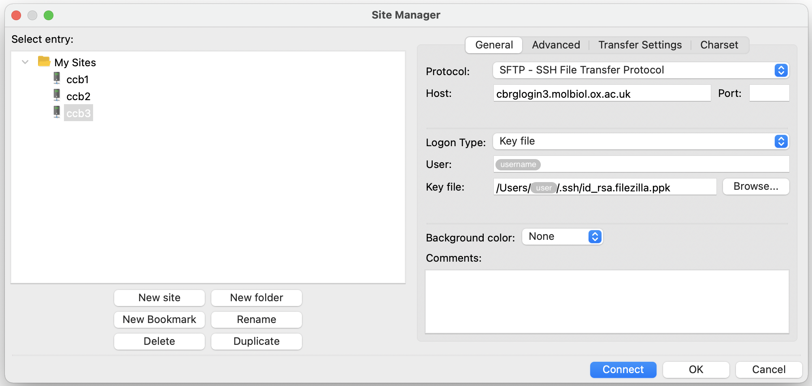
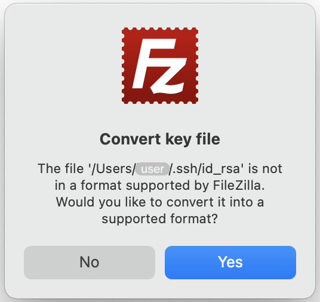
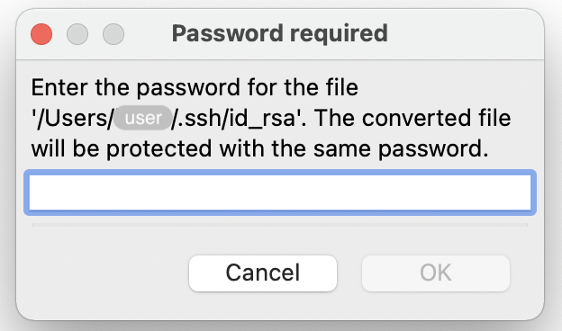
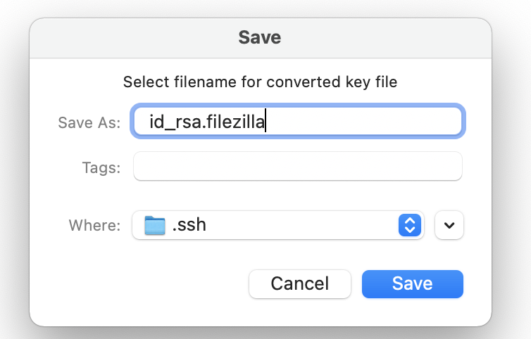
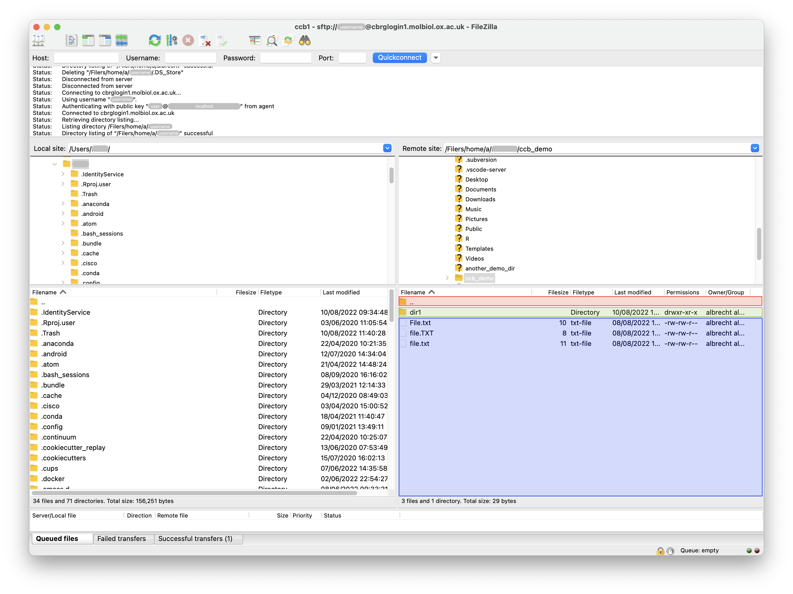

## What is FileZilla?

The [FileZilla Client][filezilla-org-download] Client is a free solution for
transferring files between computers via FTP/SFTP/FTPS protocols.

Most commonly, the FileZilla Client is used to transfer files between a local
computer -- where the FileZilla Client is installed -- and a remote computer
(e.g., the CCB cluster).

While connected to a remote computer, the main window of the FileZilla typically
looks as follows:

## Create site profiles

We encourage users to create a profile for each remote computer that they
regularly connect to using FileZilla.

A profile stores all the information necessary to connect to a remote computer.
When a profile is correctly set up, users can select a profile and click the
`Connect` button -- instead of the `Quickconnect` button associated with the
fields `Host:`, `Username:`, `Password:` and `Port:` -- saving time and avoiding
typographical mistakes.

The FileZilla Site Manager can be open from the menu as follows:

- Click of `File`.
- In the menu, click on `Site Manager...`.

In particular:

- Click the button `New site` to initialise a new profile.
- Type a short yet descriptive name for the profile.
- In the field `Protocol:`, choose `SFTP - SSH File Transfer Protocol`.
- In the field `Host:`, type the URL of one of the login nodes (see [General
  information]()).
- You may leave the field `Port:` empty.
- In the field `Logon Type:`
  - Choose `Key file` if you have created an SSH Key pair (see [Set up an SSH
    key pair]()).
- In the field `User:`, type your username on the CCB cluster.
- In the field `Key file:`, select the private SSH key that you created on your
  personal computer (typically located at `~/ssh/id_rsa`).
  - You may be prompted to convert your private key file to a format supported
    by FileZilla. If so, click `Yes` and follow the one-time instructions in the
    next section below. At the end of the process, the converted key should be
    automatically selected.
  - When setting up subsequent profiles, select the converted key directly.
- Click `OK` to save the profile (this usually closes the Site Manager).
- Reopen the Site Manager, select the profile, and click `Connect`.

## Convert a private SSH key file

The private SSH key file generated using the `ssh-keygen` command is not
directly supported by the FileZilla client.

When selecting a private key file generated using the `ssh-keygen` command, the
FileZilla Client may prompt you to convert the key file to a format supported by
the FileZilla Client.

Click `Yes`.

If your private key file is protected by a passphrase, you may be prompted to
type that passphrase, to temporarily unlock the private key file during the
conversion process, and protect the converted key file with the same passphrase.

When prompted to select a filename for the converted key file:

- In the field `Save As:`, type a descriptive filename (e.g.,
  `id_rsa.filezilla`).
- In the field `Where:`, navigate your local filesystem and select an
  appropriate location (e.g., `~/.ssh`).
- Click the `Save` button.

## Connect to a remote computer

Open the Site Manager of the FileZilla Client as follows:

- Click of `File`.
- In the menu, click on `Site Manager...`.



In the Site Manager:

- Select the profile that you wish to use.
- Click the `Connect` button.

Status messages in the panel at the top of the FileZilla Client should display
information reporting successes and failures during the connection.

When succesfully connected, the panel on the right of the FileZilla Client
should display a file explorer view of the filesystem on the remote computer.

The panel on the left of the FileZilla Client should continue to display a file
explorer view of the filesystem on the local computer.

## Navigate filesystems

While connected to a remote computer, users can use the two file explorers to
navigate the local and remote filesystems, respectively.

Each file explorer panel -- local and remote -- are sub-divided in two panels:

- The top panel displays the filesystem as a hierarchical tree, where
  directories can be expanded and collapsed, to show and hide their contents,
  respectively.
- The bottom panel displays detailed information about the contents of the
  directory currently selected in the top panel.

Both panels -- top and bottom -- can be used to navigate the corresponding
filesystem.

## Transfer files

While connected to a remote computer, users can transfer files and directories
between the local and remote computer using drag-and-drop between the left and
right panels (in either direction).

When using drag-and-drop, make sure to release the click button only when the
cursor is an area that corresponds exactly to the directory in which you want to
transfer the data.

Consider the example below.

- Dropping an item from the left into the red area on the right would copy it
  into the parent directory of the currently active directory on the right (i.e,
  next to the active directory on the right).
- Dropping an item from the left into the green area would copy it into the
  directory `dir1`.
- Dropping an item from the left into the blue area would copy it into the
  currently active directory on the right (in this case, `~/ccb_demo`).

## Move files between remote directories

While we recommend using the command line to move files within the remote
filesystem, it is possible to drag-and-drop files within the panel that displays
the file explorer on the remote computer (i.e., the panel on the right).

Importantly, using drag-and-drop within a panel does not make a copy of the
item, but moves it from one location to another.

<!-- Link definitions -->

[filezilla-org-download]:
  https://filezilla-project.org/download.php?platform=osx
