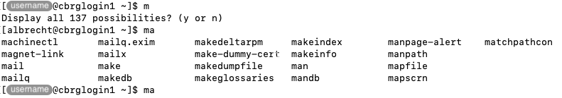

## What is autocompletion?

Autocompletion refer to the action of pressing the tabulation key after typing
the first few characters of a command name or filepath, allowing the Terminal
application to predict the rest of the word.

If the prediction unambiguously identifies a single match, the remaining characters
are automatically inserted to complete the word.
The user can then continue typing the rest of the command or filepath.

If the prediction identifies multiple matches, no autocompletion will take place.
Instead, the tabulation key can be pressed a second time to reveal the list
of ambiguous matches that were identified.
If the list of matches identified is excessively large, the terminal
may prompt for a `y` or `n` answer, whether to display all the possibilities.
Either way, the prompt will be returned with the characters typed so far,
encouraging the user to type more characters before attempting to autocomplete
again.

## The tabulation key

The tabulation key is located on the left side of most keyboards,
above the Caps Lock key.

<!-- Source: https://skillforge.com/rename-files-fast-with-the-tab-key/ (Google search)  -->

## Why use autocompletion?

The first and most obvious benefit of autocompletion is the time saved automatically
completing words at the touch of the tabulation key instead of manually typing
every single character of every command.

Meanwhile, a more subtle yet unbdoubtedly more impactful benefit of autocompletion is
the mitigation of typographical mistakes introduced by human error during the manual
typing of commands, leading to time saved not running commands that would have otherwise
failed due to typographical errors.

Instead, autocompletion acts as a dynamic sanity check that can be used to reveal whether
the characters typed so far match the expected command or file path.
In particular, autocompletion failing to identify any match is usually taken as a sign
that a typographical error is present in the characters typed so far, prompting users
to pause and proofread themselves.

While the rest of this documentation does not explicitly refer to autocompletion,
we encourage you to try it out and practice it regularly to build it into your habits
as a Bash user on the CCB cluster.

<!-- Link definitions -->
