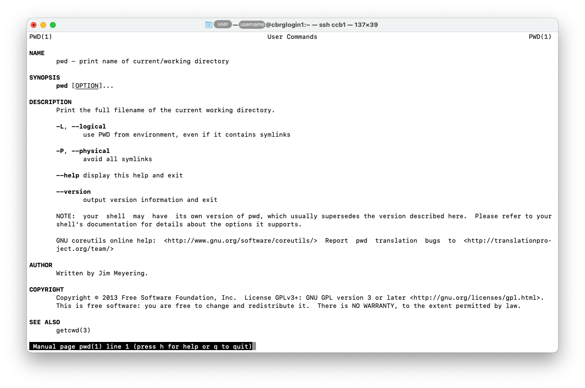
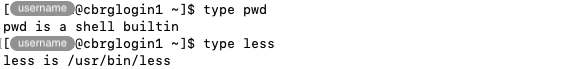

## Overview

This page is broadly arranged from completely safe command that purely display information,
to more advanced commands that modify files, directories, and the session environment.

## man

The `man <command>` command can be used to print the manual page (i.e., documentation)
for the command `<command>`.

For instance, the manual page for the command `pwd` can be displayed as follows:

```bash
man pwd
```





The ability to access, read, and understand manual pages is one of the first essential skills
to develop as a Bash user.
A lot of information and advice on Bash commands, tips and tricks, is available throughout the Internet.
However, the manual pages accessed through the `man` command correspond to the current version
of each command available on the CCB cluster, and should be considered as the reference above any
other source of information.

## type

The `type <name>` command can be used to identify how `<name>` would be interpreted
if used as a command.

```bash
type pwd
type less
```



Identifying commands that are Bash built-in or additional command from third-party
software can be helpful to understand and investigate bugs and unexpected
behaviours.

## pwd

The working directory is the directory relative to which commands typed in a
Terminal are executed.

The `pwd` command prints the current working directory.

```bash
pwd
```

When you log into the CCB cluster, the working directory is initially set to
the user's home directory.

## ls

Listing the contents of directories is essential to identify files that are
available for use, as well as directories that can be navigated into.

The `ls` command prints the list of files in a given directory.

Alone, the `ls` command prints the list of files in the working directory.

```bash
ls
```

Given the path to an existing directory, the `ls` command prints the list of
files in that particular directory.



```bash
ls /       # absolute path (starts with '/')
ls ~/.ssh  # relative path  (does not start with '/')
```

The `ls` command also accepts a number of options.
Most commonly, the `-l` option is used to display detailed information about
each file, including permissions, file size, and the timestamp of the latest
update to each file.

```bash
ls -l
```

Often, the `-h` option is added to display file sizes in human-readable format,
adding units (e.g., K - kilobyte, M - megabyte, G - gigabyte).
Multiple options can be combined under the same `-` symbol.
The two forms below are equivalent.

```bash
ls -lh
ls -l -h
```

The `-t` option can be used in combination with the `-l` option to sort files
by modification time (newest first).

```bash
ls -lt
```

The `-a` option can be used to reveal and include hidden files and directories.



```bash
ls -a
```

Finally -- to clarify -- options and paths can be combined, to list the contents
of a particular directory with specific options.

```bash
ls -lh ~/.ssh
```

## cd

Changing the working directory is often essential to run commands in the
appropriate working directory.

Alone, the `cd` command changes the working directory to the user's home directory.

```bash
cd
```

Given the path to an existing directory, the `cd` command changes the working directory to
that directory.



```bash
cd /       # absolute path (starts with '/')
cd ~/.ssh  # relative path  (does not start with '/')
```



The `..` shorthand refers to the parent directory of each directory on the system.
This can be used to move out of a directory.
The shorthand can be combined multiple times in the same path to move out multiple
levels at once.
Some examples are given below.

```bash
cd ..
cd ../..
cd ../../another_directory
```

<!-- Link definitions -->
