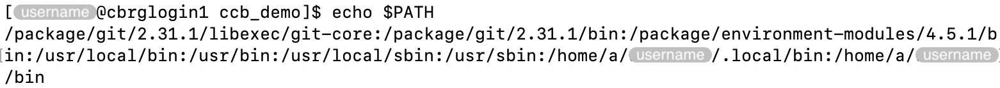
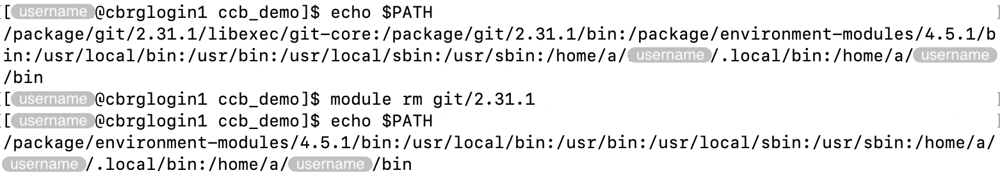

## Motivation

A variable is a named place in a computer's memory that stores a particular
piece of information (e.g., number, string).

Environment variables are variables defined and available in the shell's environment.
Those variables can be accessed by any program that runs in the shell.
They can be accessed using the `$` (dollar) symbol, followed by the name of the
environment variable (e.g., `$USER`).

Once logged into the CCB cluster, a number of environment variables are set
in the Bash session.
Existing environment variables can be modified, and new environment variables
can be defined at runtime,
including from the `~/.bashrc` file while the login shell is executed.

Some environment variables are identical for all users on the cluster,
other are derived from the username,
and users can also set environment variables themselves.
Many programs require certain environment variables to be set for their
good functioning.

In this page, we describe some of the built-in environment variables,
with a brief description of their purpose and advice on best practices.

## $HOME

The `$HOME` environment variable is set for each user to their own
home directory.



The `echo` command can be used to display the value of `$HOME`.

```bash
echo $HOME
```


The `$HOME` environment variable can also be used in commands.
For instance, users can list the contents of their home directory as follows.

```bash
ls $HOME
```

## $USER

The `$USER` environment variable is set for each user to their own
username.

The `echo` command can be used to display the value of `$USER`.

```bash
echo $USER
```


For instance, users create a directory named after their own username
as follows.
This is particularly useful to use a consistent naming of personal
directories that is guaranteed to avoid any conflict with other usernames.

```bash
mkdir $USER
```

## $PATH

The `$PATH` environment variable is unquestionably one of the most important
environment variables.

The `$PATH` is stored as a colon-separated (`:` symbol) character string that
represents the list of directories that are searched -- in the given order --
to find executable files that are invoked by users and their scripts.

As such:

- Commands may fail if the directory where they are stored is not listed
  in the `$PATH`.
- Users may need to modify their `$PATH` to add directories that contain
  commands they wish to use.
- Users may need to modify their `$PATH` to remove directories that contain
  command they do not wish to use (e.g., when a command is defined in multiple
  directories).

```bash
echo $PATH
```



Whenever possible, we recommend using the `module` command to add and remove
programs (i.e., modules) from the `$PATH`.

For instance:

```bash
module rm git/2.31.1
```



As an alternative, users may not need to modify their `$PATH` if they provide the full path to the executable file that they wish to run.
However, this approach requires many more keystrokes, and is more prone to typographical mistakes.

For instance:

```bash
/package/git/2.31.1/libexec/git-core/git status
```

<!-- Link definitions -->
