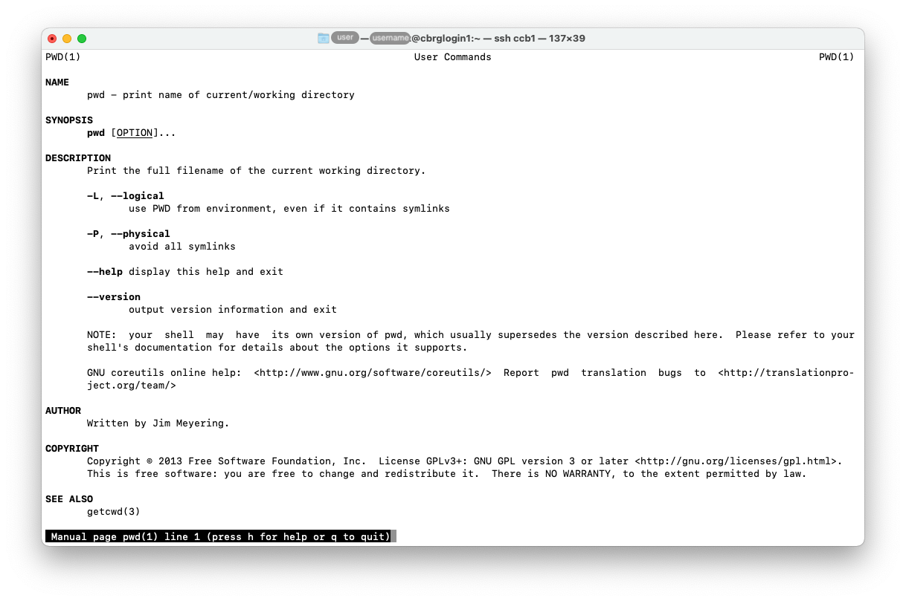

## Overview

This page introduces commands that are completely safe and purely display information
that may be used by users to get help or explore the environment of the CCB cluster

## echo

The `echo` command can be used to print a message or the value of a variable.

For instance:

```bash
echo 'Hello, world!'
```


## man

The `man <page>` command can be used to print the reference manual page `<page>`.

In many cases, `<page>` is the name of the command that you wish to execute.

For instance, the reference manual page for the command `pwd` can be displayed as follows:

```bash
man pwd
```





Incidentally, the reference manual page for the command `man` is opened as follows:

```bash
man man
```

The ability to access, read, and understand manual pages is one of the first essential skills
to develop as a Bash user.



## type

The `type <name>` command can be used to identify how `<name>` would be interpreted
if used as a command.

```bash
type pwd
type less
```


Identifying commands that are Bash built-in or additional command from third-party
software can be helpful to understand and investigate bugs and unexpected
behaviours.

## which

The `which <program>` command can be used to display the full path to the
command `<program>`.

```bash
which man
```


## groups

The `groups` command can be used to print the user groups that a user belongs to.

Alone, the `groups` command display the list of user groups that current user belongs to.

```bash
groups
```

The `groups <username>` command can also be given a username, in which case it will display
the list of user groups that particular user belongs to.

## realpath

The `realpath` command can be used to resolve the absolute file path to a specific
file or directory in the filesystem.

In many cases, files and directories may be referred to through any valid path.
However, in some cases, it may be necessary to identify and use the 'real' path
to a file or directory, meaning the unambiguous absolute path to that file from the
root directory.

```bash
realpath file1.txt
```


## wc

The `wc <file>` command can be used to count the number of lines, words,
or bytes in files.

Most commonly, the `wc` command is used with the option `-l` to
specifically focus on the number of lines in a given file.
This is particularly useful for bioinformatics file formats
where results are reported one per line.

For instance, the SAM file format reports alignments of sequences
to a reference genome, one per line, meaning that the number of lines
indicates the total number of alignments.

```bash
wc -l file1.txt 
```


Commonly used options for the `wc` command:

| Option | Long option | Description |
|:------:| ----------- | ----------- |
|  `-c`  |  `--bytes`  | Prints the byte count. |
|  `-m`  |  `--chars`  | Prints the character count. |
|  `-l`  |  `--lines`  | Prints the line count. |
|  `-L`  |  `--max-line-length`  | Prints the length of the longest line. |
|  `-w`  |  `--words`  | Prints the word count. |

<!-- Link definitions -->
