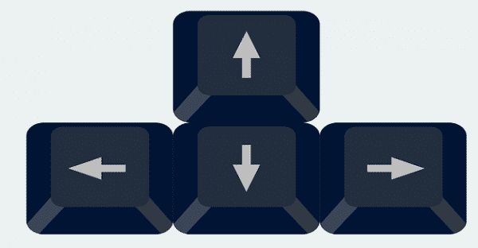

## Navigate the history of commands

The up and down arrow keys can be used to navigate the history of commands
used earlier in a Terminal session (or in an earlier Terminal session altogether).

<!-- Source: https://www.technipages.com/fix-arrow-keys-not-working-on-photos-app (Google search) -->



## Jump to the start/end of a line

The `Control` and `A` keys can be pressed simultaneously to move the cursor
instantly at the start of the current line.

Conversely, `Control` and `E` move the cursor to the end of the line.

## Abort the current command

The `Control` and `C` keys can be pressed simultaneously to interrupt a command
that is currently running in the Terminal application.

In the example below, we demonstrate this using the command `sleep`, which does
nothing but keep the terminal session busy for a set number of seconds.
During that interval of time (i.e., before the command completes),
we press the `Control` and `C` keys simultaneously, to manually interrupt the command.

<!-- Link definitions -->
