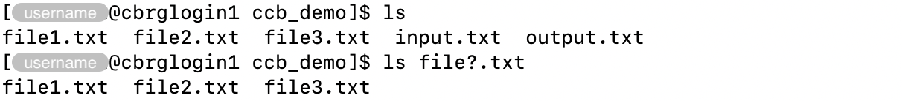

## What are wildcards?

Wildcards are special characters that match one or more characters
in filenames.

| Wildcard | Meaning |
|:--------:| ------- |
|   `*`    | Matches any sequence of characters. |
|   `?`    | Matches any single character. |
| `[characters]` | Matches any single character in a set. |
| `[!characters]` | Matches any single character _not_ in a set. |
| `[[:class:]]` | Matches any character in the specified class. |

Many commands accept groups of files and directories matched using wildcards.

For instance:

- The `rm` command can be used to remove multiple files and directories
  (remember to use the option `-r` to remove directories using `rm`).
- The `ls` command can be used to list files and the contents of directories.

## Examples

### *

The symbol `*` (asterisk) matches any sequence of one or more characters.

For instance:

```bash
ls *put.txt
```


In the example above, the `*` symbol matched:

- `in` in the file `input.txt`
- `out` in the file `output.txt`

### ?

The symbol `?` (question mark) matches any single character at that position.

For instance:

```bash
ls file?.txt
```



In the example above, the `?` symbol matched:

- `1` in the file `file1.txt`
- `2` in the file `file2.txt`
- `3` in the file `file3.txt`

### [characters]

The syntax `[ ]` (square brackets) can be used to specify a set of characters
that can be matched at a given position.

Only one of the characters in the set can be matched at the given
position, no matter how many characters are present in the set.

For instance:

```bash
ls file[12].txt
```

![Using the '[characters]' wildcard.](bracket-include.png)

In the example above, the set `[12]` matched:

- `1` in the file `file1.txt`
- `2` in the file `file2.txt`

### [!characters]

A set of characters prefixed with the symbol `!` (exclamation mark)
can be used to specify a set of character that must _not_ match
at the given position.

For instance:

```bash
ls file[!12].txt
```

![Using the '[!characters]' wildcard.](bracket-exclude.png)

In the example above, the set `[!12]` matched:

- `3` in the file `file3.txt`

### [[:class:]]

The syntax `[[: :]]` (two square brackets and a colon symbol)
can be used to specify a class of characters that can be matched at a given position.

Commonly used classes of characters are listed below.
Find more on the page [Character Classes and Bracket Expressions →][character-classes].

| Class | Description |
|:-----:| ----------- |
| `alnum` | Alphanumeric characters, including `alpha` and `digit`. |
| `alpha` | Alphabetic characters, including `lower` and `upper`. |
| `digit` | Digits: 0 1 2 3 4 5 6 7 8 9. |
| `lower` | Lower-case letters: a b c d e f g h i j k l m n o p q r s t u v w x y z. |
| `punct` | Punctuation characters: ! " # $ % & ' ( ) * + , - . / : ; < = > ? @ [ \ ] ^ _ ` { \| } ~. |
| `upper` | Upper-case letters: A B C D E F G H I J K L M N O P Q R S T U V W X Y Z. |

For instance:

```bash
ls file[[:digit:]].txt
```

![Using the '[[:class:]]' wildcard.](bracket-class.png)

## Final words

Multiple wildcards can be used in the same pattern, e.g. `file*.*`.

<!-- Link definitions -->

[character-classes]: https://www.gnu.org/software/grep/manual/html_node/Character-Classes-and-Bracket-Expressions.html
