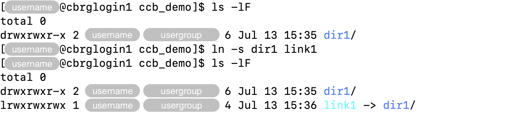

## Hard links and soft links

### Definitions

A _hard link_ is an additional name for an existing file.

A _symbolic link_ (also called _soft link_) is a file that contains
a pointer to a target file or directory.

### Consequences

Deleting all the hard links to a file will effectively delete the file itself,
as there will not be any path leading to that file in the filesystem anymore.
As long as one hard link exist, the file will continue to exist and remain
accessible (subject to read, write, and execute permission).

Symbolic links overcome two major disadvantages of hard links:

- Hard links cannot span across physical devices (i.e., disks).
  The CCB cluster is composed of many nodes and disks, making hard links
  unsuitable to many situations.
- Hard links cannot reference directories but only files.

Symbolic links become unusable if the original file is moved or deleted.
That is, unless the symbolic link is updated to point to the new location
of the target file.

Symbolic links can point to target files using absolute or relative paths
(relative to the location of the symbolic link itself).
Best practices often depend on whether the symbolic link itself is expected
to move at any point in the future:

- Symbolic link that use absolute paths will continue to point to the same
  location even if the symbolic link itself is moved.
- Symbolic link that use relative paths will point to a new location if
  the symbolic link itself is moved, relative to the new location of the
  symbolic link.

## Creating hard links

The `ln` command can be used to create links.

Hard links are created when the option `-s` is _not_ used.

The command must be given the name of the (existing) target file first,
and the name of the link second.

For instance, a _hard link_ to a file `file1.txt` named `link1.csv` can
be created as follows:

```bash
ln file1.txt link1.csv
```


## Creating soft links

Soft links are created using the same command `ln` as hard links,
while adding the option `-s`.

For instance, a _soft link_ to a file `file1.txt` named `link1.csv` can
be created as follows:

```bash
ln -s file1.txt link1.csv
```


Similarly, the example below demonstrates the creation of a _soft link_
named `link1` to a directory named `dir1`.

```bash
ln -s dir1 link1
```



<!-- Link definitions -->
