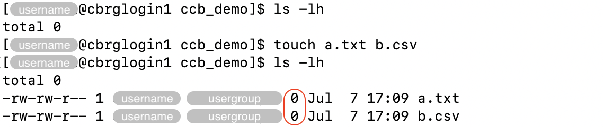
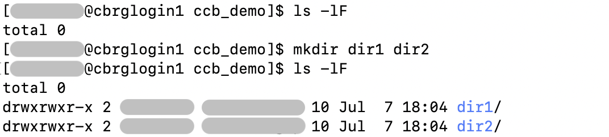
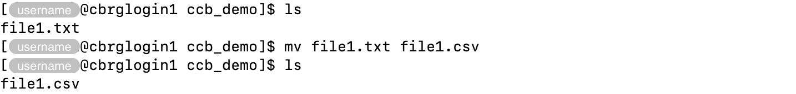
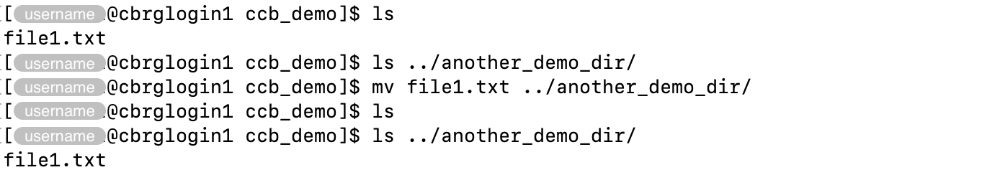
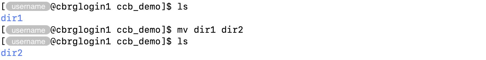
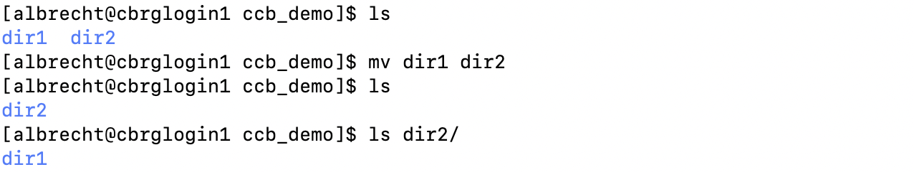
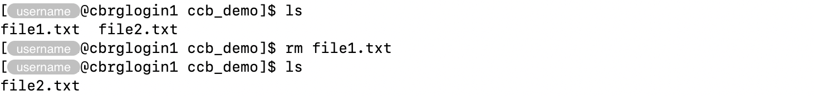
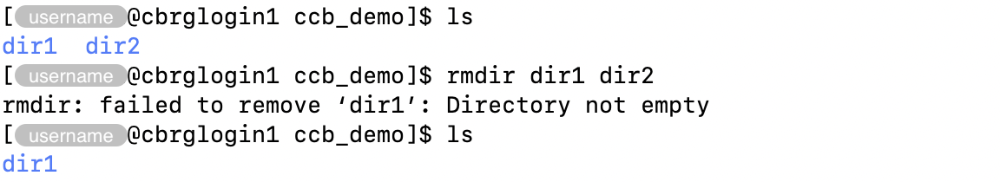

## Creating empty files

The `touch <file>` command can be used to create new empty files.

Multiple files can be created in a single command.

For instance:

```bash
touch a.txt b.csv
```





If a file already exists, the `touch` command does not edit the contents of the file,
but update the timestamp of the latest edit to the current date-time.

## Creating directories

The `mkdir` command can be used to create new directories.

Multiple directories can be created in a single command.

For instance:

```bash
mkdir dir1 dir2
```



## Copying files

The `cp` command can be used to make a copy of a file.

The command requires two arguments:

- first, the filepath to the original file
- second, the path to the file where the copy must be made

For instance:

```bash
cp a.txt a_copy.txt
```



## Copying directories

The `cp` command can be used with the option `-r` to _recursively_ copy a directory
and its contents to a new directory.

Similarly to the copy of files the command requires two arguments:

- first, the location of the original directory
- second, the path to the new directory to create as a copy.



## Moving and renaming files

The `mv` command can be used to both move and rename files.

In particular, renaming a file can be seen as moving the file from one name to another,
within the same directory.
Meanwhile, a file can be moved to another directory, either keeping the name of the file
or renaming the file at the same time.

For instance, a file `file1.txt` can be renamed to `file1.csv` as follows:

```bash
mv file1.txt file1.csv
```



On the other hand, moving a file `file1.txt` to another directory
-- without renaming the file itself --
can be done as follows:

```bash
mv file1.txt ../another_demo_dir/
```



Remember that absolute paths may be used, both for the file to move
and the directory to move it into:

```bash
mv /path/to/file1.txt /path/to/new/directory
```

Finally, a file can be moved to another directory and renamed
in a single command as follows:

```bash
mv file1.txt ../another_demo_dir/file1.csv
```



## Moving and renaming directories

Similarly to files, directories can be moved and renamed using the `mv` command.

For instance, a directory `dir1` can be renamed to `dir2` as follows:

```bash
mv dir1 dir2
```





However, if the the new directory already exist, the Bash session
will then interpret the command as a request to _move_ the first directory
into the second one.

```bash
mv dir1 dir2
```





## Removing files and directories

The `rm` command can be used to remove files and directories.

### Files

For files, the `rm` command takes the name(s) of one or more file(s)
to remove.

```bash
rm file1.txt
```



Multiple files can be removed in a single command,
stating individual filenames and/or using the wildcard symbol `*`.

For instance, the next command demonstrates how to remove
the files named `file1.txt` and `file1.csv`,
along with all files whose names start with `file2`
and all files that end with `.csv`:

```bash
rm file1.txt file1.csv file2* *.csv
```

### Directories

For directories, the `rm` command must be used with the option `-r`.

The option `-r` indicates that the directory must be remove _recursively_,
meaning that any content in the directory will be removed as well.
Refer to the `rmdir` command below for a safer alternative.

```bash
rm -r dir1
```




As a safer alternative, the `rmdir` command can be used to remove empty directories.

In the example below, the `rmdir` command is asked to remove two directories.
However, one of those directories is not empty, and only the empty directory is
actually removed.

```bash
rmdir dir1 dir2
```



### Cheatsheet

Common options for the `rm` command are listed below,
in alphabetical order of the option flag.

| Option | Long option | Descrition |
|:------:|:----------- | ---------- |
|  `-i`  | `--interactive` | Interactively prompt the user for confirmation before deleting files. Without this option, files are silently deleted. |
|  `-r`  | `--recursive` | Recursively delete directories. This option is required to delete directories. |
|  `-f`  | `--force`   | Do not prompt and ignore errors due to nonexistent files. This overrides the `-i` option. |
|  `-v`  | `--verbose` | Display informative messages as deletions are performed. |

<!-- Link definitions -->

[gnu-emacs-reference-card]: https://www.gnu.org/software/emacs/refcards/pdf/refcard.pdf
