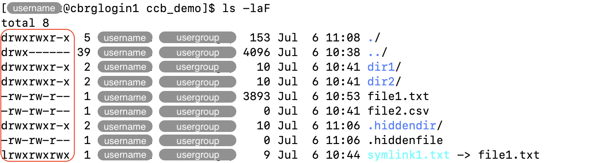
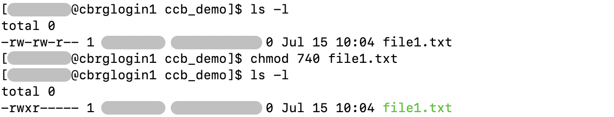

## Example scenario

In this page, examples refer to the layout of files and directories illustrated
in the schematic below.


<!-- Source: https://linuxfoundation.org/blog/classic-sysadmin-the-linux-filesystem-explained/ (Google Search) -->

## Absolute and relative paths

Absolute file paths start from the 'root' directory, represented by the `/` symbol.

For instance, in the example scenario illustrated above,
the following file and directory paths are valid:

```bash
/
/bin
/bin/bash
/usr/local
/usr/local/bin
```

Relative file paths describe paths relative to the working directory.
As such, they start with any valid character other than `/`,
either referring to the name of a sub-directory,
or using the `..` shortcut referring to the parent directory.

For instance, in the illustration above, the following file and directory paths are valid,
relative to the working directory `/usr`:

```bash
bin
include
local
local/bin
../bin
../bin/bash
../etc/crontab
```



Both absolute and relative paths can be used in Bash commands.

For instance:

```bash
cd /usr/local/bin
```

## Shortcuts

- The symbol `.` (full stop) refers to the current directory.
- The shortcut `..` (two consecutive full stop symbols) refers to the parent directory.
- The symbol `~` (tilde) refers to the home directory of the current user.
- The `/` symbol (forward slash) refers to the root directory of the filesystem.

## The working directory

The current working directory is always indicated in the prompt of the Linux shell.

In the example below, the prompt initially indicates the working directory to be
the home directory  (represented by the symbol `~`, highlighted in red below).
After using the `cd` command to change directory, the prompt then indicates the new
working directory.


## File permissions

File permissions are critical to ensure that access to individual files and directories
is restricted to the appropriate users.

Each file is owned by exactly one user (indicated in the the column highlighted as 'username' below).

Moreover, each user can belong to a number of user groups,
and each file is assigned to exactly one user group
(indicated in the the column highlighted as 'usergroup' below)
that can be given its own set of permissions on that file.



File permissions can be displayed using the `ls -l` command.
In the example below, the options `-a` and `-F` are added to display hidden files
and append a symbol indicating the type of each file.



For a single file, permissions are indicated as a sequence of characters
(e.g. `drwxrwxr-x`).

The first character is either `d` if the file is a directory,
or `-` if it is a regular file.

The remaining sequence of characters is read in triplets that
represent permissions for three groups of users:

- first triplet: the user who owns the file
- second triplet: the user group assigned to the file
- third triplet: every other user who is not the file owner and
  does not belong to the user group assigned to the file.

Each triplet is interpreted as follows:

- The character `r` indicates that the corresponding user(s) have
  _read_ access to the file (i.e., they can open the file).
- The character `w` indicates that the corresponding user(s) have
  _write_ access to the file (i.e., they can edit the file).
- The character `x` indicates that the corresponding user(s) have
  _execute_ access to the file (i.e., they can run the file as a program).
- The character `-` indicates that the corresponding user(s) do
  not have the corresponding permission on that file.

For directories, the permission are better described as follows:

- The 'read' permission indicates the permission to
  list the contents of the directory.
- The 'write' permission indicates the permission to
  create or edit files in that directory.
- The 'execute' permission indicates the permission to
  navigate (i.e., change directory) into that directory.

## Changing file permissions

The `chmod <permissions> <file_or_directory>` command can be used to modify
the permissions on individual files and directories.

Most commonly, changes in file permissions are made to:

- Make script files executable.
- Make valuable files (e.g., raw sequencing data) read-only,
  to avoid accidentally deleting them.



File permissions can be described in two formats:

- the _alphabetical_ notation,
  which is more verbose, but often easier to read and write.
- the _octal_ notation,
  which is more compact, but often takes more practice
  to read and write.

### Using alphabetical notation

To change file permissions using the alphabetical notation,
the `chmod` command takes two arguments:

- the permissions to modify
- the set of files and directories affected by those changes

The permissions to modify are declared using the following syntax:

- `u` for _user_, `g` for _group_, `o` for _other_
- `-` for _removing_ permissions, `+` for _adding_ permissions
- `r` for _read_, `w` for _write_, `x` for _execute_ permission
- `,` for separating multiple sets of changes

For instance, the example below illustrates how the `chmod` command
can be used to simultaneously:

- remove _write_ permission for the user who owns the file (i.e., `u-w`)
- add _execute_ permission for the user group assigned to the file (i.e., `g+x`)
- remove _read_ permission for every other user (i.e., `o-r`)

```bash
chmod u-w,g+x,o-r file1.txt
```


When the same permissions are applied to multiple groups, the command
may be simplified by combining the characters representing those groups together.

In the example below, read, write, and execute permissions are all removed
simultaneously from both the user group and other users:

```bash
chmod go-rwx file1.txt
```

### Using octal notation

To change file permissions using the octal notation,
the `chmod` command takes two arguments:

- the new set of permissions
- the set of files and directories affected by those changes

The new set of permissions are declared using the following syntax:

- a triplet of digits indicates the new permission for each of the
  three types of users (owner, group, other).
- a value of `4` indicates _read_ permission
- a value of `2` indicates _write_ permission
- a value of `1` indicates _execute_ permission
- for each type of user, values are added together to make a digit
  between 0 (no permission) and 7 (all permissions).

For instance, the example below illustrates how the `chmod` command
can be used to simultaneously:

- give _read_, _write_, and _execute_ permission to the owner of that file
- give only _read_ permission to the group assigned to that file
- remove all permissions to other users on that file

```bash
chmod 740 file1.txt 
```



<!-- Link definitions -->
