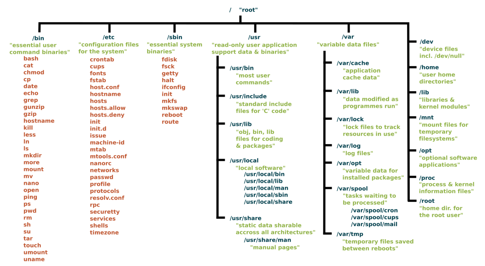

## Example scenario

In this page, examples refer to the layout of files and directories illustrated
in the schematic below.


<!-- Source: https://linuxfoundation.org/blog/classic-sysadmin-the-linux-filesystem-explained/ (Google Search) -->

## Absolute and relative paths

Absolute file paths start from the 'root' directory, represented by the `/` symbol.

For instance, in the example scenario illustrated above,
the following file and directory paths are valid:

```bash
/
/bin
/bin/bash
/usr/local
/usr/local/bin
```

Relative file paths describe paths relative to the working directory.
As such, they start with any valid character other than `/`,
either referring to the name of a sub-directory,
or using the `..` shortcut referring to the parent directory.

For instance, in the illustration above, the following file and directory paths are valid,
relative to the working directory `/usr`:

```bash
bin
include
local
local/bin
../bin
../bin/bash
../etc/crontab
```



Both absolute and relative paths can be used in Bash commands.

For instance:

```bash
cd /usr/local/bin
```

## Shortcuts

- The symbol `.` (full stop) refers to the current directory.
- The shortcut `..` (two consecutive full stop symbols) refers to the parent directory.
- The symbol `~` (tilde) refers to the home directory of the current user.
- The `/` symbol (forward slash) refers to the root directory of the filesystem.

## Working directory

The current working directory is always indicated in the prompt of the Linux shell.

In the example below, the prompt initially indicates the working directory to be
the home directory  (represented by the symbol `~`, highlighted in red below).
After using the `cd` command to change directory, the prompt then indicates the new
working directory.


<!-- Link definitions -->
