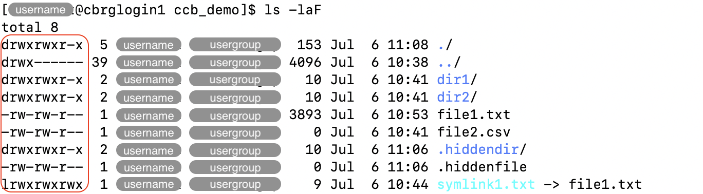

## Example scenario

In this page, examples refer to the layout of files and directories illustrated
in the schematic below.


<!-- Source: https://linuxfoundation.org/blog/classic-sysadmin-the-linux-filesystem-explained/ (Google Search) -->

## Absolute and relative paths

Absolute file paths start from the 'root' directory, represented by the `/` symbol.

For instance, in the example scenario illustrated above,
the following file and directory paths are valid:

```bash
/
/bin
/bin/bash
/usr/local
/usr/local/bin
```

Relative file paths describe paths relative to the working directory.
As such, they start with any valid character other than `/`,
either referring to the name of a sub-directory,
or using the `..` shortcut referring to the parent directory.

For instance, in the illustration above, the following file and directory paths are valid,
relative to the working directory `/usr`:

```bash
bin
include
local
local/bin
../bin
../bin/bash
../etc/crontab
```



Both absolute and relative paths can be used in Bash commands.

For instance:

```bash
cd /usr/local/bin
```

## Shortcuts

- The symbol `.` (full stop) refers to the current directory.
- The shortcut `..` (two consecutive full stop symbols) refers to the parent directory.
- The symbol `~` (tilde) refers to the home directory of the current user.
- The `/` symbol (forward slash) refers to the root directory of the filesystem.

## The working directory

The current working directory is always indicated in the prompt of the Linux shell.

In the example below, the prompt initially indicates the working directory to be
the home directory  (represented by the symbol `~`, highlighted in red below).
After using the `cd` command to change directory, the prompt then indicates the new
working directory.


## File permissions

File permissions are critical to ensure that access to individual files and directories
is restricted to the appropriate users.

Each file is owned by exactly one user (indicated in the the column highlighted as 'username' below).

Moreover, each user can belong to a number of user groups,
and each file is assigned to exactly one user group
(indicated in the the column highlighted as 'usergroup' below)
that can be given its own set of permissions on that file.



File permissions can be displayed using the `ls -l` command.
In the example below, the options `-a` and `-F` are added to display hidden files
and append a symbol indicating the type of each file.



For a single file, permissions are indicated as a sequence of characters
(e.g. `drwxrwxr-x`).

The first character is either `d` if the file is a directory,
or `-` if it is a regular file.

The remaining sequence of characters is read in triplets that
represent permissions for three groups of users:

- first triplet: the user who owns the file
- second triplet: the user group assigned to the file
- third triplet: every other user who is not the file owner and
  does not belong to the user group assigned to the file.

Each triplet is interpreted as follows:

- The character `r` indicates that the corresponding user(s) have
  _read_ access to the file (i.e., they can open the file).
- The character `w` indicates that the corresponding user(s) have
  _write_ access to the file (i.e., they can edit the file).
- The character `x` indicates that the corresponding user(s) have
  _execute_ access to the file (i.e., they can run the file as a program).
- The character `-` indicates that the corresponding user(s) do
  not have the corresponding permission on that file.

For directories, the permission are better described as follows:

- The 'read' permission indicates the permission to
  list the contents of the directory.
- The 'write' permission indicates the permission to
  create or edit files in that directory.
- The 'execute' permission indicates the permission to
  navigate (i.e., change directory) into that directory.

<!-- Link definitions -->
