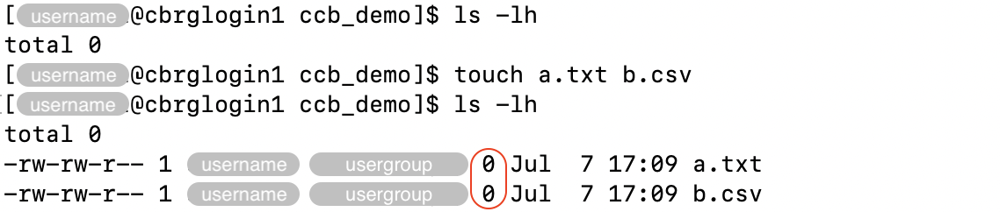

## Creating empty files

The `touch <file>` command can be used to create new empty files.

Multiple files can be created in a single command.

For instance:

```bash
touch a.txt b.csv
```





If a file already exists, the `touch` command does not edit the contents of the file,
but update the timestamp of the latest edit to the current date-time.

## Creating directories

The `mkdir` command can be used to create new directories.

Multiple directories can be created in a single command.

For instance:

```bash
mkdir dir1 dir2
```


## Copying files

The `cp` command can be used to make a copy of a file.

The command requires two arguments:

- first, the filepath to the original file
- second, the path to the file where the copy must be made

For instance:

```bash
cp a.txt a_copy.txt
```



## Copying directories

The `cp` command can be used with the option `-r` to _recursively_ copy a directory
and its contents to a new directory.

Similarly to the copy of files the command requires two arguments:

- first, the location of the original directory
- second, the path to the new directory to create as a copy.



## Moving and renaming files

The `mv` command can be used to both move and rename files.

In particular, renaming a file can be seen as moving the file from one name to another,
within the same directory.
Meanwhile, a file can be moved to another directory, either keeping the name of the file
or renaming the file at the same time.

For instance, a file `file1.txt` can be renamed to `file1.csv` as follows:

```bash
mv file1.txt file1.csv
```


On the other hand, moving a file `file1.txt` to another directory
-- without renaming the file itself --
can be done as follows:

```bash
mv file1.txt ../another_demo_dir/
```


Remember that absolute paths may be used, both for the file to move
and the directory to move it into:

```bash
mv /path/to/file1.txt /path/to/new/directory
```

Finally, a file can be moved to another directory and renamed
in a single command as follows:

```bash
mv file1.txt ../another_demo_dir/file1.csv
```



## Moving and renaming directories

Similarly to files, directories can be moved and renamed using the `mv` command.

For instance, a directory `dir1` can be renamed to `dir2` as follows:

```bash
mv dir1 dir2
```


<!-- Link definitions -->

[gnu-emacs-reference-card]: https://www.gnu.org/software/emacs/refcards/pdf/refcard.pdf
