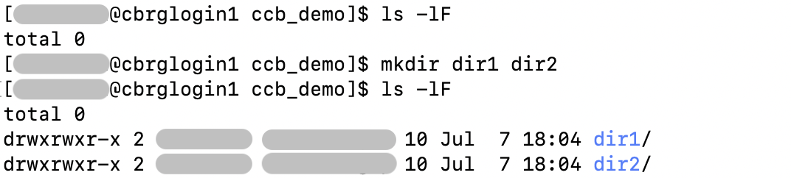

## Creating empty files

The `touch <file>` command can be used to create new empty files.

Multiple files can be created in a single command.

```bash
touch a.txt b.csv
```




## Creating directories

The `mkdir` command can be used to create new directories.

Multiple directories can be created in a single command.

```bash
mkdir dir1 dir2
```



<!-- Link definitions -->

[gnu-emacs-reference-card]: https://www.gnu.org/software/emacs/refcards/pdf/refcard.pdf
