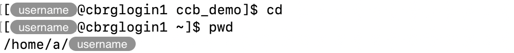

## Print working directory

The working directory is the directory where the Bash session is currently
located, and relative to which commands typed in a Terminal are executed.

The `pwd` command prints the current working directory.

```bash
pwd
```


When you log into the CCB cluster, the working directory is initially set to
the user's home directory.



## List directory contents

Listing the contents of directories is essential to identify files that are
available for use, as well as directories that can be navigated into.

The `ls` command prints the list of files in a given directory.

### Examples

Alone, the `ls` command prints the list of files and directories in the
working directory.

```bash
ls
```




Given the path to an existing directory, the `ls` command prints the list of
files in that particular directory.



```bash
ls /       # absolute path (starts with '/')
ls ~/.ssh  # relative path  (does not start with '/')
```

The `ls` command also accepts a number of options.
Most commonly, the `-l` option is used to display detailed information about
each file, including permissions, file size, and the timestamp of the latest
update to each file.

```bash
ls -l
```


Often, the `-h` option is added to display file sizes in human-readable format,
adding units (e.g., K - kilobyte, M - megabyte, G - gigabyte).
Multiple options can be combined under the same `-` symbol.
The two forms below are equivalent.

```bash
ls -lh
ls -l -h
```


The `-t` option can be used in combination with the `-l` option to sort files
by modification time (newest first).

```bash
ls -lt
```




The `-a` option can be used to reveal and include hidden files and directories.

```bash
ls -a
```




Finally -- to clarify -- options and paths can be combined, to list the contents
of a particular directory with specific options.

```bash
ls -ltah ~/.ssh
```




### Cheatsheet

Common options are listed below, in alphabetical order of the option flag.

| Option | Long option | Descrition |
|:------:|:----------- | ---------- |
|  `-a`  | `--all`     | Display all files including hidden files. |
|  `-d`  | `--directory` | Display information about a directory instead of listing the contents of that directory. Usually combined with option `-l`. |
|  `-F`  | `--classify` | Append an indicator to the end of each listed name (e.g., `/` for a directory) |
|  `-h`  | `--human-readable` | Combine with option `-l` to display file sizes in human readable format rather than bytes. |
|  `-l`  |             | Display information in long format. |
|  `-r`  | `--reverse` | Display results in reverse order. See also options `-S` and `-t` |
|  `-s`  |             | Sort by file size. |
|  `-t`  |             | Sort by latest modification time. |

## Change directory

Changing the working directory is often essential to run commands in the
appropriate working directory.

Given the path to an existing directory, the `cd` command changes the working directory to
that directory.

```bash
cd /       # absolute path (starts with '/')
cd ~/.ssh  # relative path  (does not start with '/')
```




Alone, the `cd` command changes the working directory to the user's home directory.

```bash
cd
```





The `..` shorthand refers to the parent directory of each directory on the system.
This can be used to move out of a directory.
The shorthand can be combined multiple times in the same path to move out multiple
levels at once.
Some examples are given below.

```bash
cd ..
cd ../..
cd ../../another_directory
```



## Final advice

Use [Autocompletion]()!

Briefly, the tabulation key (TAB) may be pressed after typing the first few 
characters of the name of a valid directory, allowing the Bash session to
predict and automatically complete the name of the directory.

Autocompletion is automatically available for file paths on the CCB cluster,
saves a lot of manual typing, and avoid typographical errors that often
go unnoticed and raise errors when executed.

This process can be repeated multiple times within the same command,
even within the same path: type a few characters, press TAB, press
type a few more characters, press TAB, etc.

There are two main reasons why nothing might happen when you press TAB
while autocompleting the path to a directory or file:

1. The path that you have typed so far does not exist.
2. The path that you have typed so far is ambiguous.

The easiest way to diagnose which scneario you are in is to press TAB
a second time.

If a number of options appear, matching the characters that you typed so far,
it means that the path that you have typed so far is ambiguous.
You need to type more characters manually to disambiguate the path
before attempting to use autocompletion again.


If nothing appears after having pressed TAB twice, then you likely are
in the first scenario: the path that you have typed so far does not exist.
You might want to proofread what you typed so far, but the fastest way
to fix the path is to type it all from scratch again
(using autocompletion to avoid typographical errors).
