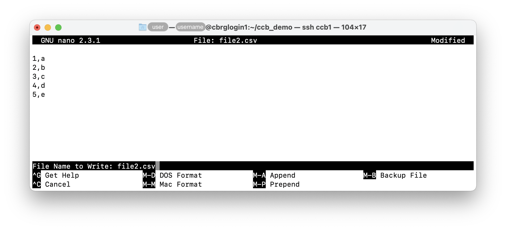
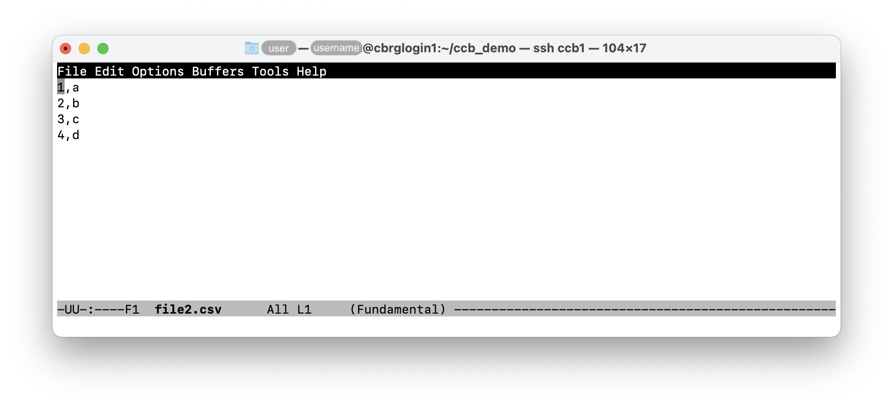
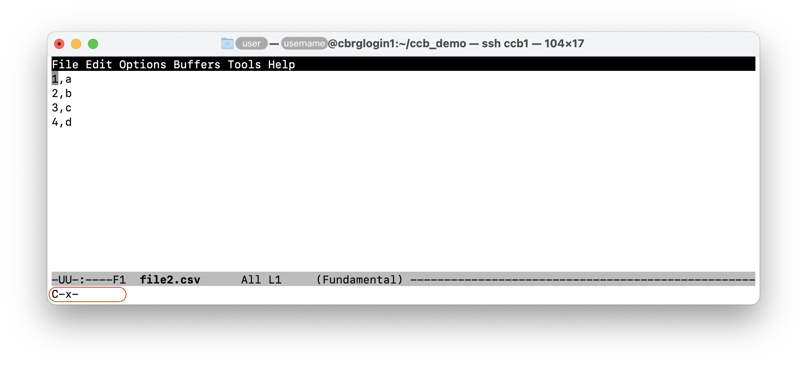
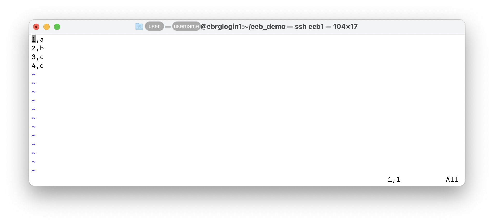
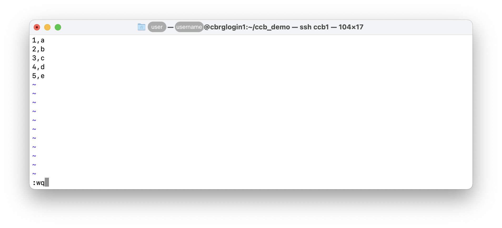
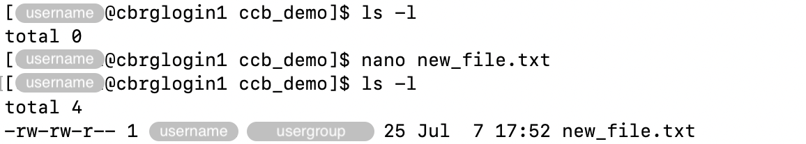

## Display the contents of a file

### Full contents

The `cat <file>` command can be used to display the entire contents of a file
in the Terminal application.

For instance:

```bash
cat file2.csv 
```




### First lines

The `head <file>` command be used to display the first few lines of a file.

The number of lines displayed can be controlled using the `-n` option.
In the absence of option, the first 10 lines are shown by default.

Example usage:

```bash
head file2.csv
head -n 3 file2.csv
```


### Last lines

The `tail <file>` command be used to display the last few lines of a file.

This command works very much like the `head` command.

```bash
tail -n 3 file2.csv
```


## Interactively scroll through files

### more

The `more <file>` command can be used to scroll through a file
unidirectionally from top to bottom.

While the viewer is active in a Terminal application,
pressing the `Space` bar scrolls down one screen worth down
the contents of the file.

Once the end the file is reached, the interactive viewer
automatically terminates and returns the Linux prompt to the user.

### less

The `less <file>` command provides similar yet more extensive
functionality over the `more` command ("less is more").

While the viewer is active, the `Up` and `Down` arrow keys can be used
to scroll one line up or down the contents of the file.

The `Left` and `Right` arrow keys can be used to scroll one screen worth
left or right across the contents of the file.

Similarly to the `more` command, the `Space` bar can be used to scroll
one screen worth down the contents of the file.

The `Q` key can be pressed to close the interactive viewer
(reaching the end of the file will not automatically close the interactive viewer).

## Editing files in the Terminal

### nano

The `nano <file>` command can be used to open an interactive text editor
in the Terminal application.


In particular:

- The arrow keys can be used to move the cursor through the file.
- Common keyboard shortcuts are displayed at the bottom of the editor.
- The `^` symbol represents the `Control` key.
- For instance, `^X` indicates that pressing the `Control` and `X` keys
  simultaneously will exit the interactive text editor.

To save edits made to a file:

- Press the `Control` and `X` keys simultaneously to initiate the exit
  from the editor.
- When prompted whether to 'Save modified buffer', press `Y` to confirm.
- When prompted for the 'File Name to Write', immediately press the
  Return key to use the current file name.



To close a file without saving the edits:

- Press the `Control` and `X` keys simultaneously to initiate the exit
  from the editor.
- When prompted whether to 'Save modified buffer', press `N` to discard
  the changes.

To save the new version of the file under a different name:

- Press the `Control` and `X` keys simultaneously to initiate the exit
  from the editor.
- When prompted whether to 'Save modified buffer', press `Y` to confirm.
- When prompted for the 'File Name to Write',
  edit the file name as needed,
  and press the Return key to write the modified file under the new filename.
  The original file will be left unchanged.

### emacs

The `emacs <file>` command can be used to open an interactive text editor
in the Terminal application.



In particular:

- The arrow keys can be used to move the cursor through the file.
- The [GNU Emacs Reference Card][gnu-emacs-reference-card]
  list many keyboard shortcuts that make Emacs one of the most
  efficient text editors in Terminal applications.

To save edits made to a file:

- Press the `Control` and `X` keys simultaneously
  to initiate a command,
  then `Control` and `S` simultaneously to save the file.





To close a file:

- Press the `Control` and `X` keys simultaneously
  to initiate a command,
  then `Control` and `C` simultaneously to close the file.



### vim

The `vim <file>` command can be used to open an interactive text editor
in the Terminal application.



In particular:

- The arrow keys can be used to move the cursor through the file.
- The editor initially opens the file in _Read-only_ mode.
  To edit the file, press the `I` key to enter _Edit_ mode.
- To disable _Edit_ mode, press the `Esc` key to return to
  _Read-only_ mode.

To save edits made to a file:

- Press the `:` key to open a prompt for commands within the editor.
  Then, type `wq` to _write_ the file and _quit_ the application
  (press the Return key to execute the command).



To close a file without saving the edits:

- Press the `:` key to open a prompt for commands within the editor.
  Then, type `q!` _force quit_ the application (the `!` symbol
  forces the command to override warnings of unsaved changes).

## Creating new files

Text editors such as `nano`, `emacs`, and `vim` can be used to create new files,
immediately opening those files in an interactive text editor.

To create new files, those commands must be given a filename that does not exist yet.

For instance:

```bash
ls -l
nano new_file.txt
# edit and save the file
ls -l
```



<!-- Link definitions -->

[gnu-emacs-reference-card]: https://www.gnu.org/software/emacs/refcards/pdf/refcard.pdf
