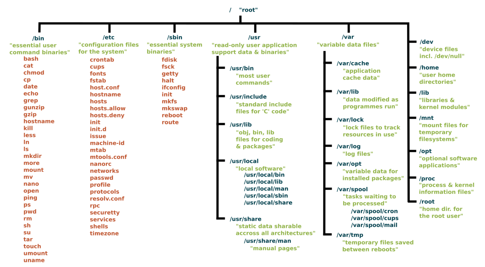

## What is Linux?

Linux is an operating system (OS), like Microsoft Windows
(MS Windows) and macOS.

However, Linux is open source and free of cost.

Linux and macOS are different, but share a large number of commands
as macOS is based on BSD (Berkeley Standard Distribution) which is
similar to Linux but not Linux.

More technical differences include:

- File names are case-sensitive in Linux (and macOS) while they are
  not in MS Windows.
- File paths are separated by `/` (forward slash) on Linux (and macOS),
  while they are separated by `\` (back slash) on MS Windows.


## The Linux file system

In the Linux filesystem, everything is a file.

A directory is a file that contains the list of files and directories that it contains.

As a result, files organised in a tree structure.
The first directory in that tree is called 'root',
and it is represented by the symbol `/` (forward slash).

The schema below illustrates some of the core directories and files that
make up the Linux filesystem.


<!-- Source: https://linuxfoundation.org/blog/classic-sysadmin-the-linux-filesystem-explained/ (Google Search) -->



## Working with Linux file paths

### Absolute and relative paths

Absolute file paths start from the 'root' directory, represented by the `/` symbol.

For instance, in the illustration above, the following file and directory paths are valid:

```bash
/
/bin
/bin/bash
/usr/local
/usr/local/bin
```

Relative file paths describe paths relative to the working directory.
As such, they start with any valid character other from `/`,
either referring to the name of a sub-directory,
or using the `..` shortcut referring to the parent directory.

For instance, in the illustration above, the following file and directory paths are valid,
relative to the working directory `/usr`:

```bash
bin
include
local
local/bin
../bin
../bin/bash
../etc/crontab
```



### Shortcuts

- The symbol `.` (full stop) refers to the current directory.
- The shortcut `..` (two consecutive full stop symbols) refers to the parent directory.
- The symbol `~` (tilde) refers to the home directory of the current user.
- The `/` symbol (forward slash) refers to the root directory of the filesystem.

### Working directory

The current working directory is always indicated in the prompt of the Linux shell.

In the example below, the prompt initially indicates the working directory to be
the home directory  (represented by the symbol `~`, highlighted in red below).
After using the `cd` command to change directory, the prompt then indicates the new
working directory.


## What is Bash?

Bash (Bourne Again Shell) is the shell, or command language interpreter,
for the GNU/Linux operating system.
In other words, it is the programming language that is used to issue commands to the
operating system from the Terminal application.

## How do I use Bash?

If you have gone through the earlier section
[Connect to CCB](),
then congratulations: you have been using Bash already!

From the moment you typed commands such as `ssh` and `passwd` in the Terminal
application, you have been working in a Bash session, and issuing commands
to the operating system from that Bash session.

Once logged into the CCB cluster, the Terminal application
gives you access to the Linux shell
-- i.e., the command line interface --
where you can type commands that are given to the operating system
and executed in the current Bash environment.

## Where do I go from here?

Once connected to the CCB cluster, you can use built-in Bash commands to:

- list and navigate directories in the filesystem
- create, edit, remove, open and execute files
- create and remove directories
- ...and much more!

In the following pages, this documentation introduces commonly used built-in
Bash commands and options, and describing best practices on the CCB cluster.

<!-- Link definitions -->

[gnu-what-is-bash]: https://www.gnu.org/software/bash/manual/html_node/What-is-Bash_003f.html
