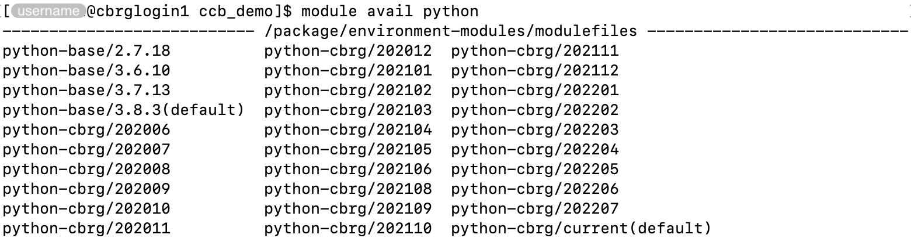
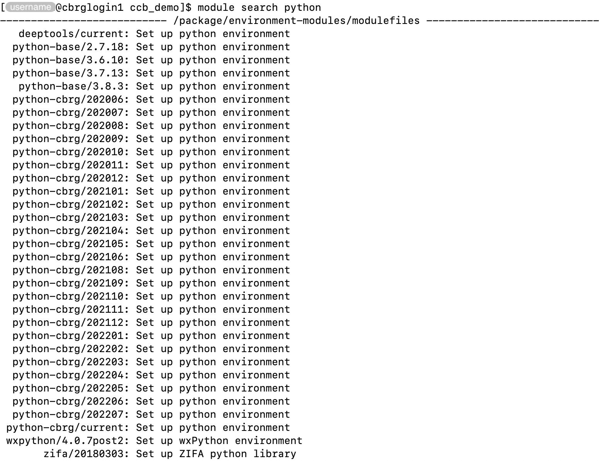

## What are modules?

Environment modules provide a central installation of software available
to multiple users on the same computer system.

Individual software modules can be loaded and unloaded easily using
the `module` command, which dynamically modifies the user's shell
environment as needed.

For each module, configuration files are created and maintained by
system administrators.

As such, new modules can be requested from system administrators
(refer to the [Contact]() section),
subject to time and availability.



## List available modules

The `module avail` command can be used to list modules currently available.

```bash
module avail
```

This command generally displays an uncessarily large list of modules.

The command can be given a pattern of module names to search for.

For instance:

```bash
module avail python
```



## Search modules

The `module search` command is an alternative method for searching modules
by keyword.

```bash
module search python
```



## List modules currently loaded

The `module list` command can be used to list modules that are currently load

```bash
module list
```


<!-- Link definitions -->
