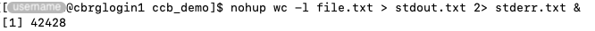

## What happens when the connection is lost?

The connection to a Bash session on the CCB cluster may be lost for a number
of reasons:

- Loss of internet connection anywhere between your computer and the CCB cluster.
- Power loss causing an unexpected outage of CCB systems.
- Loss of connection to the University VPN (if applicable).

When the connection to a Bash session is lost, the `HUP` (hangup) signal is sent
to the Bash session.
The `HUP` signal prompts the Bash session to terminate commands that are currently
running, potentially resulting in lost work for users.

## How to run commands immune to loss of connection?

### nohup

The `nohup` command can be used to run a command that is immune to the `HUP` signal.

The process launched by the `nohup` command will ignore any `HUP` signal, and
continue running until the command completes.

By default, the standard output of the process launched by the `nohup` command is
redirected to a file `nohup.out` in the working directory, unless the command
explicitly redirects the standard output to another file.

By default, the standard error of the process launched by the `nohup` command is
not saved.
However, the command can explicitly redirect the standard error to a file using
the operator `2>`.

The `&` symbol is commonly added at the end of `nohup` command, to launch those
commands in the background.

For instance:

```bash
nohup wc -l file.txt > stdout.txt 2> stderr.txt &
```



In particular:

- The `nohup` command is used to make the command immune to the `HUP` signal;
  the command will continue to run even in the event of network connection loss
  problems.
- The `wc` command is used to count the number of lines in the file `file.txt`.
- The standard output of the command is redirected to the file `stdout.txt`.
- The standard error of the command is redirected to the file `stderr.txt`.

### tmux

The `tmux` command launches an open-source terminal multiplexer for Unix-like operating systems.

It allows multiple terminal sessions to be accessed simultaneously in a single window.
It is useful for running more than one command-line program at the same time.

To start your first tmux session on the CCB cluster, type `tmux` in the Terminal application, while logged into the CCB cluster:

```bash
tmux
```


The green banner at the bottom indicates that the user is now in a tmux session.
At this point, users can then work in that terminal session like any other Bash session.

However, a benefit of the tmux session is that it will continue to exist and keep running commands alive even if the connection between the client and the CCB cluster is lost, or users close the Terminal application.

For instance:

- Close the Terminal application.
- If prompted, click 'Terminate' to force-quit the application.
- Open a new Terminal application.
- Log into the CCB cluster.
- Type `tmux attach` (or, in abbreviated form, `tmux a`).

```bash
tmux attach
```

The very same tmux session will be attached to the new Bash session and users can pick up their work where they left off.

Sometimes, users may wish to effectively terminate one tmux session and start another (e.g., to reset the state of their Bash session).
To do so, terminate the Bash session running in the current tmux session using any of the logout methods described in the section [Log out]().

For instance:

```bash
logout
```

Do so until you fully exit the tmux session (i.e., the green banner at the bottom of the Terminal application has disappeared).
You should see a the message `[exited]`, indicating that you have exited the tmux session.


Then, start a new tmux session using the `tmux` command:

```bash
tmux
```




A 'Tmux Cheat Sheet & Quick Reference' is available at <https://tmuxcheatsheet.com/>.

For more details, search search "tmux tutorial" in a search engine or YouTube.

### Emacs

Emacs is a family of text editors that are characterized by their extensibility.

The command `emacs` launches the application.

```bash
emacs
```


The Emacs editor can be configured to persist in the event of a connection loss, independently of tmux sessions.

To do so, the Emacs daemon -- a program that runs continuously as a background process -- must run in the Bash session.

To automatically start the Emacs daemon in every new Bash session, add the following lines to the `~/.bashrc` file.

```bash
export ALTERNATE_EDITOR=""
alias emacs="emacsclient --tty"
```

Then, launch the Emacs application.

```bash
emacs
```

At this point, users can then work in that Emacs session without fear of losing work in the event a connection loss.

For instance:

- Type anything in the Emacs application.
- Close the Terminal application.
- If prompted, click 'Terminate' to force-quit the application.
- Open a new Terminal application.
- Log into the CCB cluster.
- Type `emacs`.

The very same Emacs session will be restored in the new Bash session and users can pick up their work where they left off.

We do recommend regularly saving your work in the Emacs text editor (i.e., saving the contents of the buffer to a file).

A ‘GNU Emacs Reference Card’ is available at <https://www.gnu.org/software/emacs/refcards/pdf/refcard.pdf>.

For more details, search search "emacs tutorial" in a search engine or YouTube.

<!-- Link definitions -->
