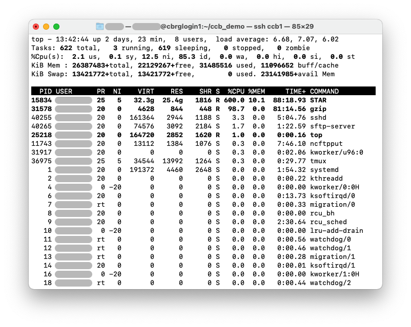
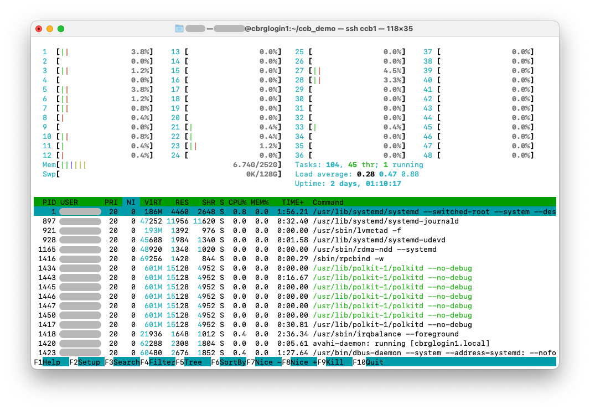
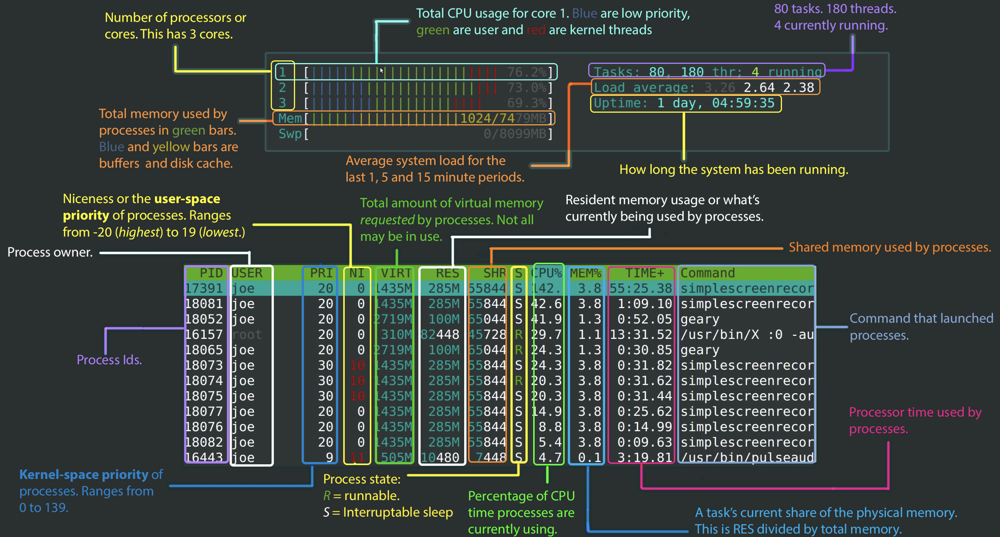
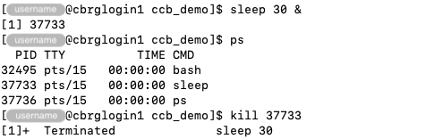
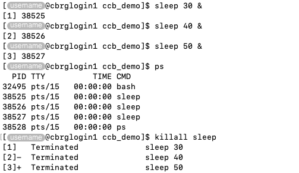

## Snapshot current processes

The `ps` command can be used to report a snapshot of the current processes.

```bash
ps
```


The output of the `ps` command will always include at least two entries:

- The `bash` process that is used to run the current Bash session.
- The `ps` process itself, which is being being executed to snapshot
  currently running processes.

Then, any other process that is currently running will be reported by the `ps` command.

For instance:

```bash
sleep 10 &
sleep 20 &
sleep 30 &
ps
```


In particular:

- `PID` -- Process identifier (unique).
- `TTY` -- Terminal type.
- `TIME` -- CPU runtime.
- `CMD` -- Process name.

## Real-time monitoring

The commands `top` and `htop` can be used to display a dynamic real-time view of a running system.

### top

The `top` command can be used to monitor processes and resource usage in real time.

Information is displayed as a table that can be filtered and sorted.

Above the table, a header displays system-wide information
(e.g., total number of processes, memory available).

```bash
top
```



### htop

The `htop` command can be used to launch an interactive process viewer.

Similarly to the `top` command, informatio is displayed as a table that can be filtered
and sorted, as well as a header that displays system-wide information
(e.g., total number of processes, memory available, CPU usage).

```bash
htop
```



An annotated example output of the `htop` command is presented below.



## Terminate a process

### kill

Processed can be terminated (often said 'killed'), either by users
-- including system administrators -- or by the system itself.

Common reasons for terminating processes include:

- They are taking too long (e.g., froze, entered an infinite loop).
- They are using too many resources (e.g., memory, open file connections).
- They are no longer functioning properly.

The `kill` command can be used to terminate processes specified by their
`PID` (**P**rocess **ID**entifier).

```bash
sleep 30 &
ps
kill <PID>
```



### killall

The `killall` command can be used to terminate all processes by name.

For instance, the code below launches a series of `sleep` commands,
and then terminates all of them by name, without the need to specify
their respective `PID`.

```bash
sleep 30 &
sleep 40 &
sleep 50 &
ps
killall sleep
```



## Cheatsheet

Common options for the `ps` command are listed below:

| Option | Descrition |
|:------:| ---------- |
|  `-e`  | Select all processes.  Identical to `-A`. |
|  `-f`  | Do full-format listing (i.e., displays additional information). |
| `-u <user>` | This selects the processes whose effective user name or ID is <user>. |

For instance, replace `<user>` by your own username and run the command below
to display only your processes in full format:

```bash
ps -f -u <username>
```

<!-- Link definitions -->
