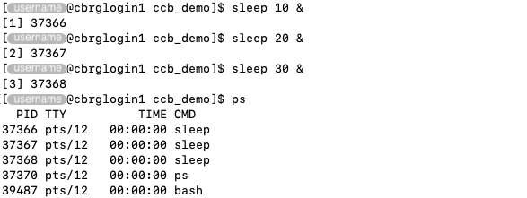

## Snapshot current processes

The `ps` command can be used to report a snapshot of the current processes.

```bash
ps
```


The output of the `ps` command will always include at least two entries:

- The `bash` process that is used to run the current Bash session.
- The `ps` process itself, which is being being executed to snapshot
  currently running processes.

Then, any other process that is currently running will be reported by the `ps` command.

For instance:

```bash
sleep 10 &
sleep 20 &
sleep 30 &
ps
```



In particular:

- `PID` -- Process identifier (unique).
- `TTY` -- Terminal type.
- `TIME` -- CPU runtime.
- `CMD` -- Process name.

## Cheatsheet

Common options for the `ps` command are listed below:

| Option | Descrition |
|:------:| ---------- |
| `-e` | Select all processes.  Identical to `-A`. |
| `-f` | Do full-format listing (i.e., displays additional information). |
| `-u <userlist>` | This selects the processes whose effective user name or ID is in <userlist>. |

For instance, replace `<username>` by any valid username and run the command below
to display only the processes for the selected user in full format:

```bash
ps -f -u <username>
```

<!-- Link definitions -->
