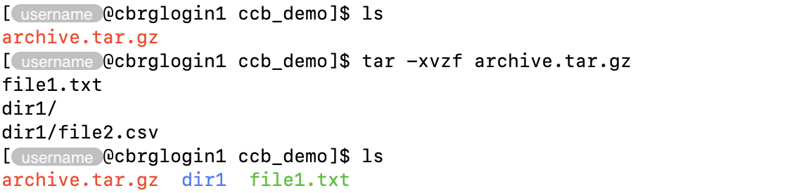

## Why compress files?

Raw data files and files created during analyses can be large (up to hundreds of GB).

Compressing files is an efficient way to save disk space.

## Compress using gzip

The `gzip` command can be used to compress files.

```bash
gzip file1.txt
```


By default, the original file is removed, and the file extension `.gz`
is added to the original file name, to form the name of the new
compressed file.

## Decompress using gunzip

The `gunzip` command can be used to decompress files that were compressed
using the `gzip` command.

```bash
gunzip file1.txt.gz
```


By default, the original file is removed, and the file extension `.gz`
is removed from the original file name, to form the name of the new
compressed file.

## Redirect to standard output

The option `-c` can be used in both commands `gzip` and `gunzip` for major
benefits:

- The original files are kept unchanged (i.e., not deleted).
- The compressed or decompressed output is redirected to the standard output of
  the command, meaning that the symbol `>` can be used to redirect that standard
  output to any filename (circumventing the default behaviour of both commands).

For instance:

```bash
gzip -c file1.txt > compressed.txt.gz
```


## Archive using tar

The `tar` command stands for _tape archive_.

It is an archiving file format that combines multiple files -- and directories --
into a single file, called a _tar archive_.

Optionally, tar archives can be further compressed during their creation --
using, for instance, the `gzip` command.

The `tar` command can be used to create, modify, and extract files that are
archived in the `.tar` format.

For instance, a directory and a file can be archived together as follows:

```bash
tar -czvf archive.tar.gz file1.txt dir1
```


In particular:

- The option `-c` creates a new archive.
- The option `-z` further compresses the archive using the `gzip` command.
- The option `-v` verbosely lists the files processed as they are being archived.
- The option `-f` declares the name (and location) of the archive file to create.

## Extract from a tar archive

As mentioned above, the `tar` command can also be used to extract files and
directories from a tar archive.

For instance:

```bash
tar -xvzf archive.tar.gz
```



## Final words

Many programs support gzip-compressed input files.
For those programs, there is no need to decompress the files before use.

<!-- Link definitions -->
