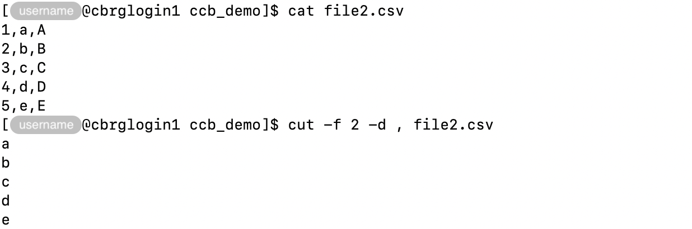
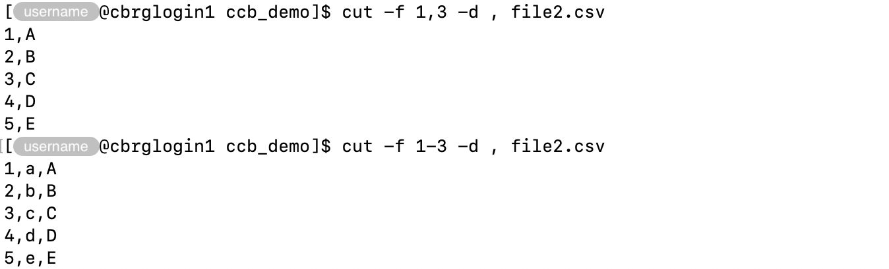
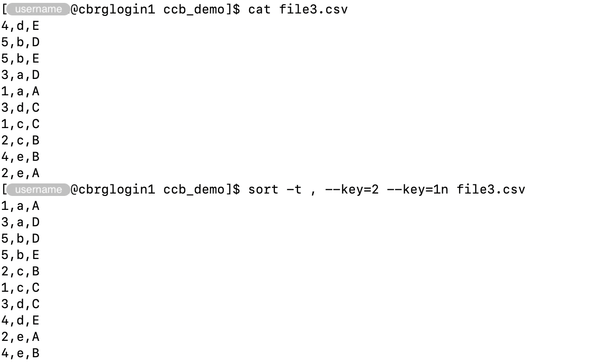
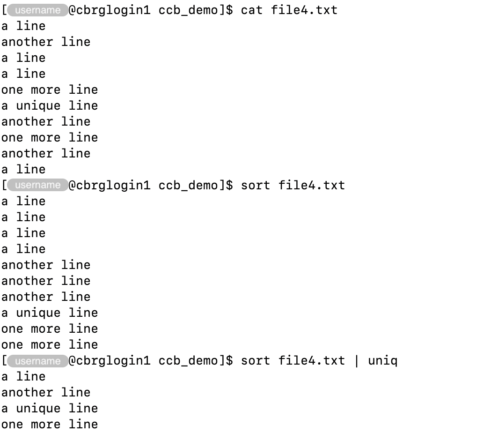

## Print lines matching a pattern

The `grep` command can be used to search files and print only lines that
match a given pattern.

The pattern to search for must be given as a [Regular expression →][regular-expression-info].
The regular expression does not always need to include special wildcard characters;
it can be as simple as the exact sequence of characters to search for.

The example below illustrates how the lines of the file `file.txt`
that contain exactly the word `error` can be identified and returned to the
standard output of the Terminal session.

```bash
grep error file.txt 
```


Common options for the `grep` command:

| Option | Long option | Description |
|:------:| ----------- | ----------- |
|  `-i`  | `--ignore-case` | Ignore case (i.e., do not distinguish between upper and lower case characters).  |
|  `-v`  | `--invert-match` | Invert match. Print lines that do not contain a match. |
|  `-c`  | `--count`   | Print the count of matches, not the matches themselves. |
|  `-l`  | `--files-with-matches` | Print the name of each file that contans a match, not the matches themselves. |
|  `-L`  | `--files-without-matches` | Like the `-l` option, but print the name of files that do not contain a match. |
|  `-n`  | `--line-number` | Prefix each match with the number of the line within the file. |
|  `-h`  | `--no-filename` | When searching across multiple files, suppress the output of filenames. |

The example below illustrates how the `grep` command can be used
to print lines that do _not_ contain the pattern `"error"`.

```bash
grep -v error file.txt
```


## Extract columns from a file

The `cut` command can be used to extract one or more columns from a file.

In particular:

- The option `-d` defines the delimiter that is used to separate columns.
  In unspecified, tabulation is used as a delimiter.
- The option `-f` defines the index (or indices) of the fields to extract.

For instance, the third column of a comma-separated file (comma: `,`)
can be extracted as follows:

```bash
cut -f 3 -d , file2.csv
```



Multiple columns can be declared either as a comma-separated list (e.g., `1,2,4,5,6`)
or using the hyphen `-` (e.g., `1-2,4-6`).

For instance:

```bash
cut -f 1,3 -d , file2.csv
cut -f 1-3 -d , file2.csv
```



## Sort file contents

The `sort` command can be used to sort the lines in a file
according to the values of one or more columns in each line.

In particular:

- The option `-t` defines the delimiter that is used to separate columns.
  In unspecified, white space characters (including tabulation) are used as
  field delimiters.
- The option `--key` declares one or more fields (i.e., columns) to use
  for sorting.
  This option can be declared multiple times in the same command,
  to declare multiple fields to sort by, breaking ties in earlier fields
  using subsequent fields.
  The `sort` command is rarely used without the `--key` option,
  in which case the whole line is used for sorting.

In its simplest form, the option `--key` uses the following syntax:

- First, the numeric index indicating the position of the field to use
  for sorting.
  This can be given as a single value (e.g., `2`),
  or a comma-separated pair of values indicating the 
  starting field and the ending field indices to use for sorting.
- Then, one or one or more single-letter ordering options among
  `bdfgiMhnRrV`, which override global ordering options for that key.
  Most commonly, the `n` option is used to override the default
  alphanumerical ordering by numerical ordering.

For instance:

```bash
sort -t , --key=2 --key=1n file3.csv
```



In particular:

- The options `-t` is used to indicate that the symbol `,`
  is used as field delimiter.
- The first option `--key` declares that the second field should be used
  to order lines, in alphebetical order of that field.
- The second options `--key` declares that the first field should be used
  to break ties, in numerical order of that field.

## Process duplicated lines

The `uniq` command can be used to remove duplicated lines,
or count the number of occurences of each distinct line in a file.

### Omit repeated lines

The `uniq` command assumes that the file is sorted and only detects duplicated
lines that are adjacent to each other.
The command `sort` is commonly used to sort the contents of a file, passing the
standard output of the `sort` command into the standard input of the `uniq` command
using the Linux pipe `|`.

For instance:

```bash
sort file4.txt | uniq
```



In particular:

- First, the `sort` command is used to sort lines in the input file
  in alphabetical order (default sorting order).
- Then, the `uniq` command is used to report the first occurence of
  each distinct line in the sorted input.

### Count unique lines

The option `-c` prompts the `uniq` command to print the count of occurences
for each distinct line in a sorted input.

For instance:

```bash
sort file4.txt | uniq -c
```


### Report unique lines

Instead of reporting the first occurence of each _distinct_ line,
the option `-u` can be used to report only _unique_ lines
(i.e., lines that only occur a single time throughout the entire sorted
input).

```bash
sort file4.txt | uniq -u
```


### Other options

Ignore case.

```bash
uniq -i file4.txt
```

<!-- Link definitions -->

[regular-expression-info]: https://www.regular-expressions.info/quickstart.html
