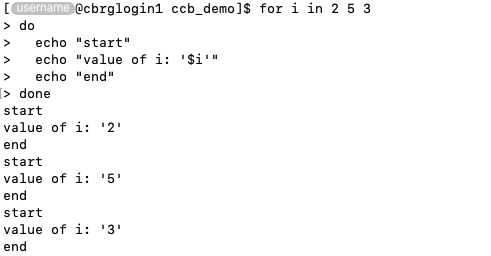

## Motivation

Sets of commands can be enclosed in programmatical loops,
that are repeated until all inputs are processed or a certain condition is met.

## The for loop

The `for` loop takes a list of inputs, and iterates over each item in the list,
repeating a set of commands -- once for each input -- until all inputs are processed.

For instance:

```bash
for i in 2 5 3
do
  echo "start"
  echo "value of i: '$i'"
  echo "end"
done
```



In particular:

- The operator `for` declares the start of the loop definition.
- The (arbitrary) variable name `i` is declared as the iterator that will take a different
  value during each iteration.
- The values to iterate over are given as a space-separated list.
- The operator `do` declares the start of the set of commands to execute during each
  iteration of the loop.
- A series of commands print messages in the Terminal.
  In this example, the first and third messages remain the same for each iteration,
  while the second message dynamically uses the value of the iterator for each specific
  iteration.
  The commands are indented only for visual effect; this is not necessary, but it generally
  improves the readability of Bash scripts.
- The operator `done` declares the end of the set of commands to execute during each
  iteration of the loop.

```bash
for i in {1..3};
do
  echo "value of i: '$i'"
done
```

```bash
for i in seq 1 3;
do
  echo "value of i: '$i'"
done
```

## The while loop

The `while` loop takes a conditional statement, and repeats a set of commands
indefinitely while the statement remains true.
The loops terminates only when the statement is false at end of an iteration.



<!-- Link definitions -->
