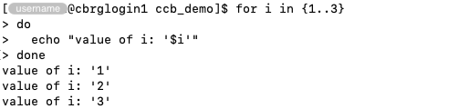
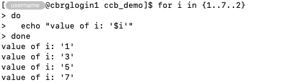
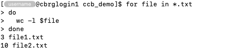
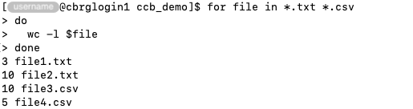

## Motivation

When repeatedly executing the same set of commands on a series of inputs,
loops can be used to:

- Define a set of input.
- Define a set of commands.
- Execute the set of commands on the set of inputs.

## The for loop

The `for` loop takes a list of inputs, and iterates over each item in the list,
repeating a set of commands -- once for each input -- until all inputs are processed.

### Integer over fixed inputs

The `for` loop can be given a list of inputs to iterate over as a space-separated
array of values.

For instance:

```bash
for i in 2 5 3
do
  echo "start"
  echo "value of i: '$i'"
  echo "end"
done
```


In particular:

- The operator `for` declares the start of the loop definition.
- The (arbitrary) variable name `i` is declared as the iterator that will take a different
  value during each iteration.
- The values to iterate over are given as a space-separated list.
- The operator `do` declares the start of the set of commands to execute during each
  iteration of the loop.
- A series of commands print messages in the Terminal.
  In this example, the first and third messages remain the same for each iteration,
  while the second message dynamically uses the value of the iterator for each specific
  iteration.
  The commands are indented only for visual effect; this is not necessary, but it generally
  improves the readability of Bash scripts.
- The operator `done` declares the end of the set of commands to execute during each
  iteration of the loop.

### Iterate over integer values

The curly braces `{}` and the `seq` command can be used to rapidly generate
regular sequences of integer values to iterate over.

The syntax `{start..end}` can be used to generate a sequence of integers
from `start` to `end` in increments of 1.

The example below illustrate how this syntax can be used to iterate over the
integers from 1 to 3 by increments of 1.

```bash
for i in {1..3}
do
  echo "value of i: '$i'"
done
```



Furthermore, the extended syntax `{start..end..increment}` can be used to control the
increment to use.

The example below illustrate how this syntax can be used to iterate over the
integers 1 to 7 by increments of 2.

```bash
for i in {1..7..2}
do
  echo "value of i: '$i'"
done
```



Similarly, the `seq` command can be used to the same effect.

The example below iterates over the integer values from 1 to 3 by increments of 1.

```bash
for i in $(seq 1 3)
do
  echo "value of i: '$i'"
done
```

The example below iterates over the integer values from 1 to 7 by increments of 2.

```bash
for i in $(seq 1 2 7)
do
  echo "value of i: '$i'"
done
```

### Iterate over files

The `for` loop can be used to iterate over files, with the iterator variable
taking the value of each filename during each iteration.

While the list of filenames to process can be typed in manually, wildcards are
often used to match groups of files by pattern.

For instance:

```bash
for file in *.txt
do
  wc -l $file
done
```



Multiple patterns can be given in a single expression, as each pattern
automatically expands into the corresponding list of filenames.

```bash
for file in *.txt *.csv
do
  wc -l $file
done
```

## Final words

When writing a new loop, consider testing it on a small set of inputs
before executing it on the full set of inputs,
as a small set of inputs will run much more quickly during the testing phase.

Consider adding commands that display informative messages during the
execution of the loop:

- The `echo` command can be used to print messages on the standard output.
- This may help for debugging (e.g., identifying the iteration when an issue occured).
- This may help tracking the progress of the loop
  (e.g., printing the number of iterations so far, or the name of the file being processed).



<!-- Link definitions -->
