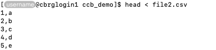

## What are streams?

Streams are mechanisms to pass data from one file or command to another.

For instance, a few common scenarios that use streams:

- passing the contents -- not the name ! -- of a file as the input to a command
- passing the output of a command as the input to another command
- writing the output of a command to a (new or existing) file

Some standard streams are commonly referred to in Linux:

- standard input (stdin): the default device (i.e., resource)
  from which input to the system is taken.
- standard output (stdout): the default file descriptor
  where a process (i.e., command) can write output
- standard error (stderr): the default file descriptor
  where a process (i.e., command) can write error messages

By default, both _stdout_ and _stderr_ write to the terminal.
However, it is possible to redirect their respective output to
separate destinations (most commonly, files).

## Redirecting streams

Streams can be redirected to new destinations -- including files -- using
the symbols `>`, `<`, and variants thereof.

### Standard input

The contents of a file can be redirected to the standard input of a command
using the syntax `command < file`.

For instance:

```bash
head < file2.csv
```



### Standard output

Conversely, the standard output of a command can be redirected to a file
using the syntax `command > file`.

For instance:

```bash
echo "Some text" > file.txt
```




### Appending to a file

In contrast to the single symbol `>` which overwrites the contents of a file
with the standard output of a command,
the operator `>>` can be used to _append_ that standard output to the file,
using the syntax `command >> file`.

For instance:

```bash
echo "Some more text" >> file.txt
```


### Standard error

The standard output of a command can be redirected to a file
using the operator `2>`in the syntax `command 2> file`.

For instance:

```bash
ls missing 2> stderr.txt
```


In the example above, the error message is written and saved to a file,
instead of being displayed in the Terminal application and lost when the
application is closed.

### General advice

Redirecting the standard error -- and the standard output, for that matter --
can be extremely helpful to investigate and diagnose errors and bugs.
Many command produce significant amounts of information on the standard output
and standard error, making it a real challenge to identify the source of
unexpected issues while scrolling through many screens worth of information.

In particular, redirecting the standard output and standard error to different
files is highly recommended, to separate generally informative messages that
report on the normal functioning of a program from important error messages
that highlight unexpected issues.

Finally -- and confusingly -- some programs are known to misuse
the standard output and standard error streams; most frequently, writing informative
messages in the standard error stream.
Unfortunately, there is nothing that users can do about this, apart from identifying
those programs and getting used to where they can find relevant information.

<!-- Link definitions -->
