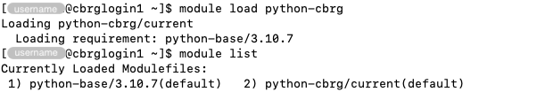

## Overview

As well as the standard Python versions that you would normally expect, the CCB
cluster administrators additionally preinstalled hundreds of additional packages
available for all to use. These are available via the `python-cbrg` module.

## Basic usage

If you just want to get up and running with set of commonly used bioinformatics
packages curated by the CCB cluster administrators, you can do so with a single
command:

```bash
module load python-cbrg
```





<!-- Link definitions -->
