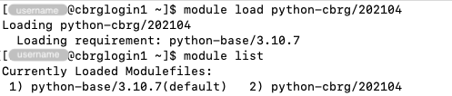

## Overview

As well as the standard Python versions that you would normally expect, the CCB
team additionally preinstalled hundreds of additional packages available for all
to use. These are available via the `python-cbrg` module.

## Basic usage

If you just want to get up and running with set of commonly used bioinformatics
packages curated by the CCB team, you can do so with a single command:

```bash
module load python-cbrg
```




## Request additional packages

If you need to use a package which is not already installed, please contact the
CCB team via the address below before attempting to install a local copy. In
many cases the CCB team can easily add it to the central installation.

## Advanced usage

The setup of the `python-cbrg` module uses the following system.

The `python-base` module contains fixed, unchanging installations of the base
language. This is for safety –- they cannot be accidentally overwritten causing
unexpected changes of behaviour. The module `python-cbrg` contain separate
package and library repositories for each version of Python. Because packages
and library versions also change over time, we take a snapshot of the state on a
monthly basis and then lock this to prevent changes causing unexpected
behaviour. A single current version for each provides a continual rolling 'head'
where changes are applied. Loading the `python-cbrg` module will automatically
pull in the latest stable base and all packages or libraries.

For instance:

```txt
module load python-cbrg
module list
```


However, if you want to use a different version of the base, you can do that by
loading it manually first:

```bash
module load python-base/3.6.10
module load python-cbrg
module list
```


Simmilarly, if you want to use a different version of the libraries, for example
because a recent update broke something you relied on, you can do that by
loading it manually:

```bash
module load python-cbrg/202104
module list
```



## Getting help

You can email the CCB team using the email address <genmail@molbiol.ox.ac.uk>.
Using this address ensures your email is logged and assigned a tracking number,
and will go to all the core team, which means the appropriate person or people
will be able to pick it up.

## Copyright

This text is copyright University of Oxford and MRC and may not be reproduced or
redistributed without permission.

## Author

Duncan Tooke (<duncan.tooke@imm.ox.ac.uk>) and Kevin Rue-Albrecht
(<kevin.rue-albrecht@imm.ox.ac.uk>).

<!-- Link definitions -->
