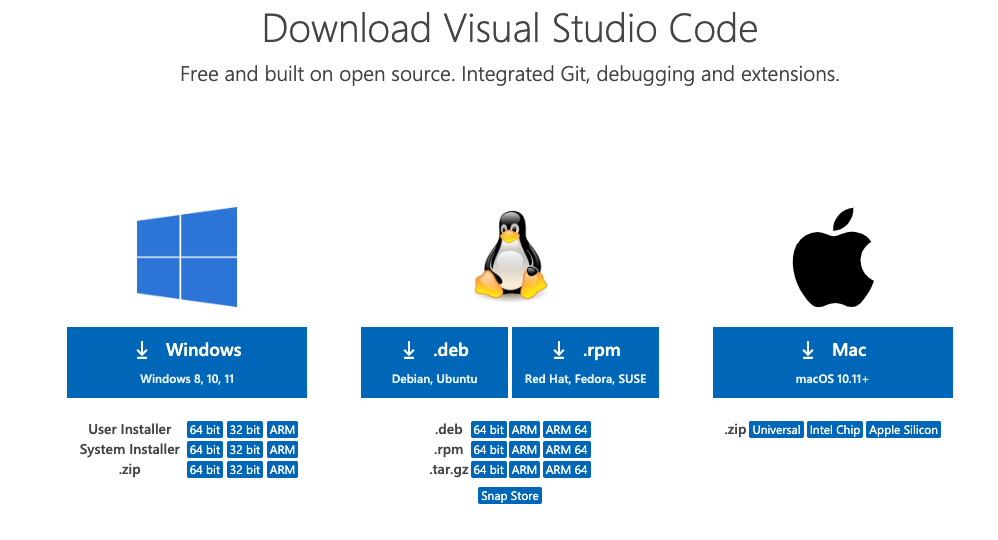
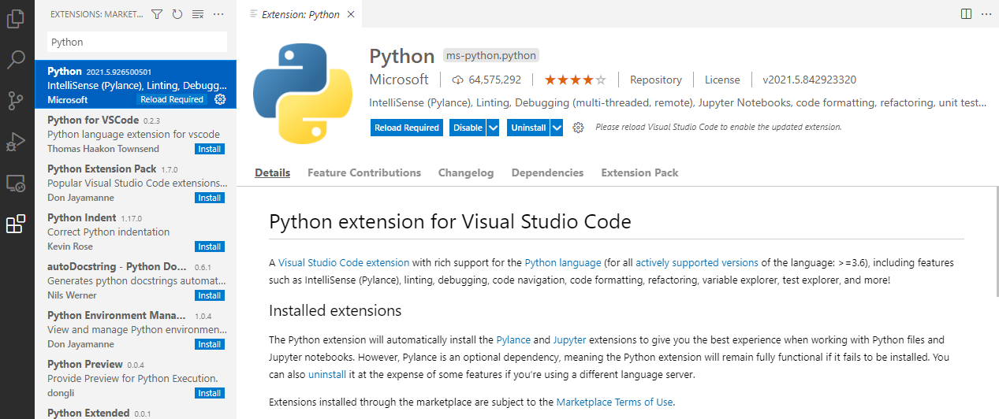
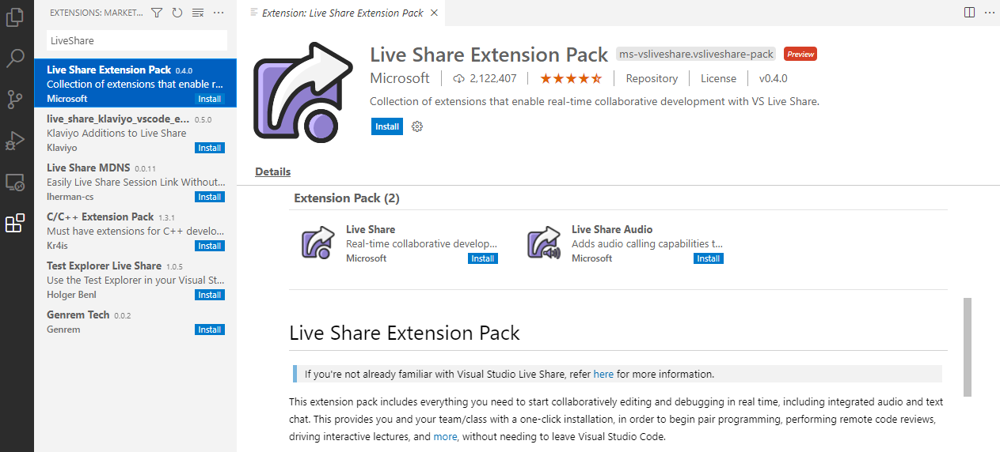



## Install Visual Studio Code (VSCode)

### Download the installer file

In your web browser, navigate to <https://code.visualstudio.com/download>.

Click on the button 'Mac', making sure that it matches the version of your operating system.

You may be redirected to another web page.
However, the download should start automatically.

### Unpack and install the application

In Finder, navigate to the downloaded file.
This should be a ZIP archive.

Double-click on the downloaded ZIP file to extract its contents.
This should be a file called 'Visual Studio Code.app'.

Drag and drop the file 'Visual Studio Code.app' into your 'Applications' folder.

You may then delete the ZIP archive that you downloaded.

### Install VSCode extensions

Launch VSCode.

Click on the 'Extension' tab on the left.

- Search for the extension named 'Python' and install it.

- Search for the extension named 'Live Share Extension Pack' and install it.

## Install Anaconda navigator

In your web browser, navigate to <https://www.anaconda.com/>.

### Run the installer

Double-click on the installer file that you just downloaded
and progress through the screens of the installation program.



- Accept all defaults.

### Test your installation

- In the Launchpad, find and launch 'Anaconda-Navigator'.

If prompted about a new version of Anaconda Navigator available,
click 'Yes' to update.

<!-- Link definitions -->
