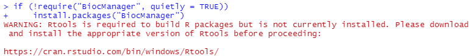
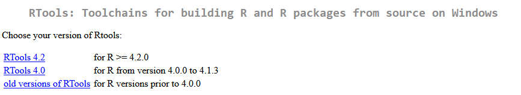
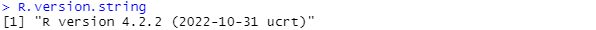
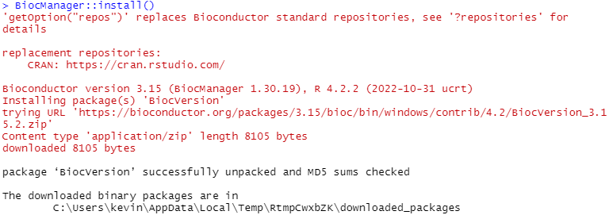

## Motivation

The Bioconductor project provides many R packages focused on the analysis of
biological assays.

## Install BiocManager

Instructions are available on the [main Bioconductor
website][bioconductor-install].

Briefly, first launch RStudio.

Then, run the following command in the R console:

```r
if (!require("BiocManager", quietly = TRUE))
    install.packages("BiocManager")
```

## RTools

When running the command above, you may be prompted with the following warning
message:



In which case, please navigate to
<https://cran.rstudio.com/bin/windows/Rtools/>.



Click on the link 'RTools x.x' (where `x.x` is a version of RTools). In
particular, select a version of RTools that matches the version of R that you
are currently using.





On the next page, click on the link to download the RTools installer (e.g., this
is 'Rtools42 installer' for RTools 4.2).

Then, double-click on the installer file that you just downloaded and progress
through the screens of the installation program.

We recommend leaving all options to their default values.

We also recommend closing RStudio and launching a new RStudio application.

## Install the latest version of Bioconductor

In the R console of the RStudio application, run the following command:

```r
BiocManager::install()
```

You should see messages similar to the following.



In this example, Bioconductor version 3.15 was installed, as the latest version
of Bioconductor compatible with R 4.2.2.



<!-- Link definitions -->

[bioconductor-install]: https://www.bioconductor.org/install/
