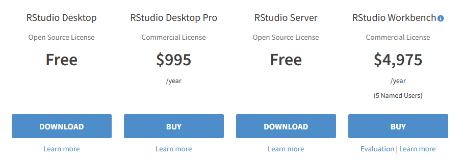

## Motivation

Instructions on this page should be followed in order to produce the desired effects, namely:

- [R][r-cran] must be installed before the [RStudio IDE][rstudio-download],
  so that the [RStudio IDE][rstudio-download] detects at least one version of [R][r-cran].

## Install R

### Download the installer file

In your web browser, navigate to <https://cran.r-project.org/bin/windows/base/>.

On the web page, click on the link 'Download R-x.x.x for Windows'
(where `x.x.x` is the latest version of R available for Windows).

### Run the installer

Double-click on the installer file that you just downloaded
and progress through the screens of the installation program.

We recommend leaving all options to their default values.

### Test your installation

- Double-click on the desktop icon `R x.x.x`.

The `RGui` application should open with an R Console.

You can close the application.

## Install RStudio Desktop IDE

In your web browser, navigate to <https://www.rstudio.com/products/rstudio/download/>.

On the web page, click on the button 'Download'
in the column 'RStudio Desktop - Open Source License - Free'.

On the next page, click on the button 'DOWNLOAD RSTUDIO FOR WINDOWS'.

We recommend leaving all options to their default values.

### Test your installation

Once the installer has completed successfully:

- Open the Windows Start Menu.
- In the Windows Start Menu find and launch 'RStudio'.

The `RStudio` application should open.

<!-- Link definitions -->

[r-cran]: https://www.r-project.org/
[rstudio-download]: https://www.rstudio.com/products/rstudio/download/
