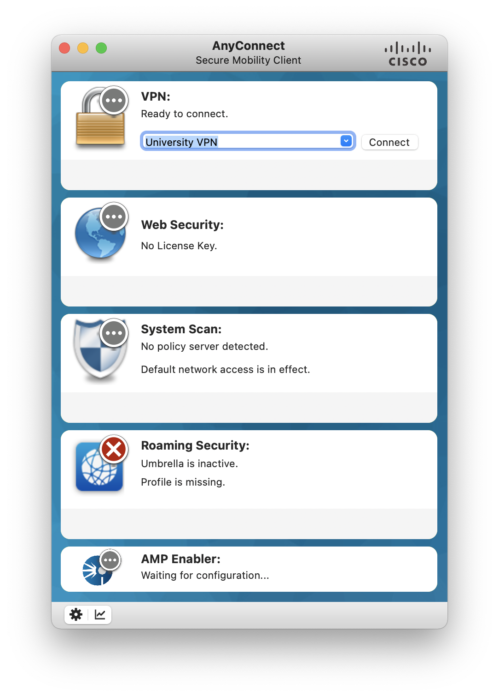
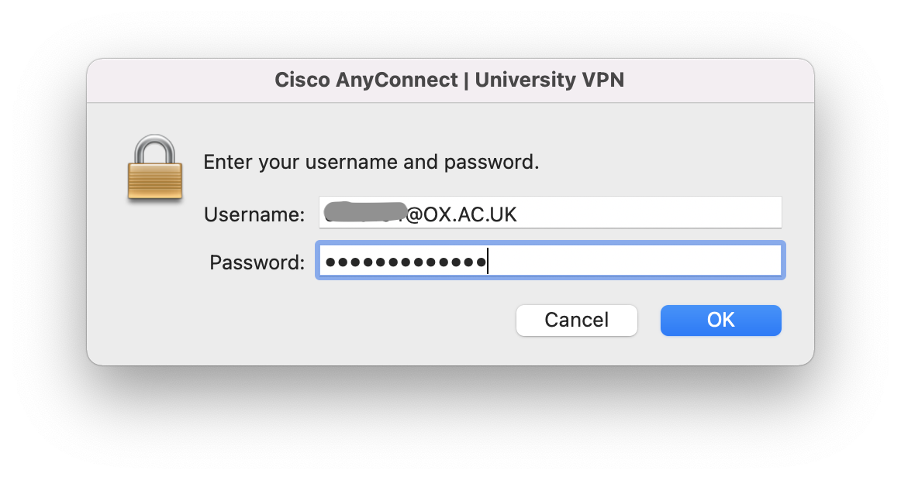
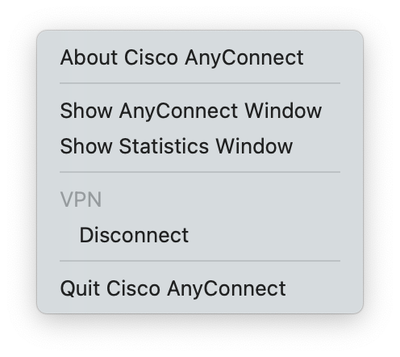

## General information

The CCB cluster is accessible only from the University campus network.

When your device is not directly connected to the University campus network
(e.g., when you are working from home or travelling), the VPN Service allows
you to access the University campus network, and thus the CCB cluster.

## Set up a VPN client

The web page <https://help.it.ox.ac.uk/vpn> provide the latest information
about requirements and instructions to set up recommended VPN clients.

## The Cisco AnyConnect VPN client

Having installed the Cisco AnyConnect VPN client and set up the University VPN,
the VPN client should display the University VPN in the dropdown menu.

<i>Cisco AnyConnect VPN client.</i>

## Connection

In the Cisco AnyConnect VPN client, select the University VPN and click the button
'Connect'.

When prompted, type in your username and password. Then, click 'OK'.

<i>Connect using Cisco AnyConnect VPN client.</i>

You are now connected to the University campus network!

## Disconnection

Once connected, you will see an icon in your computer's menu bar .

Click on it to reveal the application's menu.

<i>Cisco AnyConnect menu while connected.</i>

In the menu, click 'Disconnect'.

You are now disconnected from the University campus network and using only
your own internet connection again.
